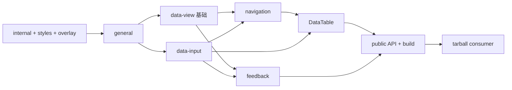

# Lyra UI Phase 1 Implementation Plan

> **For agentic workers:** REQUIRED SUB-SKILL: Use superpowers:subagent-driven-development (recommended) or superpowers:executing-plans to implement this plan task-by-task. Steps use checkbox (`- [ ]`) syntax for tracking.

**Goal:** 将 `crm-ui` 的 primitives 提取为可独立验证并首次发布的 `@noah-ji/lyra-ui@0.1.0`，本阶段不修改 `crm-ui` 消费代码。

**Architecture:** `lyra-ui` 成为组件源码、主题、测试和 Storybook 的独立仓库。组件按依赖拓扑迁移，构建输出显式公开入口、ESM、CJS、声明和单一 CSS；发布前必须通过真实 tarball consumer，首次 npm 身份验证与 2FA 由用户完成。

**Tech Stack:** React 19、TypeScript 5.9、Vite 7、Tailwind CSS 4、Radix UI、Vitest 4、Testing Library、Storybook 10、Playwright、Biome、pnpm 10、npm 11。

---

## 阶段边界

本计划只执行设计文档中的阶段一：

- 源只读：`/Users/noahji/workspace/code/linyi/frontend/crm-ui`
- 目标写入：`/Users/noahji/workspace/code/github/lyra-ui`
- 设计规格：`docs/superpowers/specs/2026-07-10-lyra-ui-extraction-design.md`
- 不修改 `crm-ui/package.json`、imports、styles 或本地 primitives。
- 不在自动化步骤中代替用户执行 npm 登录、2FA 或最终发布确认。
- `@noah-ji/lyra-ui@0.1.0` 在 registry 可安装并复验后，阶段一才完成。

当前已验证环境：Node `v24.16.0`、pnpm `10.32.1`、npm `11.13.0`。

## 文件结构锁定

### 删除

- `components/**`：旧 Button/LESS 试验实现。
- `eslint.config.js`、`stylelint.config.js`、`.prettierrc`、`.prettierignore`：改用 Biome。
- `vite-env.d.ts`：新 tsconfig 直接声明 Vite 类型。
- `.storybook/**`：旧配置引用将被删除的 `components/Button`，Task 14 重建。
- `.github/workflows/npm-publish.yml`：删除长期 token 发布流程。

### 创建或重建

- `src/components/{general,data-input,data-view,navigation,feedback}/**`：迁入组件。
- `src/internal/{cn.ts,disclosure-motion.ts}`：不公开的共享实现。
- `src/overlay/{index.ts,z-stack.ts}`：公开浮层层级 API。
- `src/styles/{index.css,brand.css,theme.css,data-table.css}`：发布 CSS 来源。
- `src/{index.ts,build-entry.ts}`：根入口与 CSS 构建入口。
- `tests/{components,architecture,visual}/**`：行为、边界和视觉验证。
- `fixtures/consumer/**`：真实 tarball 消费者。
- `config/public-entrypoints.json`：公开入口唯一清单。
- `scripts/{rewrite-imports,sync-package-exports,verify-dist,verify-tarball,verify-consumer,verify-registry,release-preflight}.mjs`：迁移与发布验证。
- `vite.config.ts`、`vite.library.config.ts`、`vitest.config.ts`、`playwright.config.ts`：分离开发、发布、测试配置。
- `tsconfig.base.json`、`tsconfig.json`、`tsconfig.build.json`：检查与声明构建。
- `.github/workflows/ci.yml`：普通 CI。
- `.github/workflows/release.yml`：首次发布后创建的 OIDC 发布流程。
- `README.md`、`LICENSE`、`AGENTS.md`：公开文档与维护契约。

## 依赖拓扑



---

### Task 1: 固定源基线与已知失败

**Files:**
- Create: `docs/migration/source-baseline-a46db7ee.md`

- [ ] **Step 1: 确认两个仓库状态**

Run:

```bash
git -C /Users/noahji/workspace/code/github/lyra-ui status --short --branch
git -C /Users/noahji/workspace/code/linyi/frontend/crm-ui status --short --branch
git -C /Users/noahji/workspace/code/linyi/frontend/crm-ui rev-parse HEAD
```

Expected:

```text
lyra-ui: main 相对 origin/main ahead 2，工作区无未提交文件
crm-ui: 工作区无未提交文件
crm-ui HEAD: 09427cc53070894fa7cbbf8cbb83ab579ae341ad
```

若 `crm-ui HEAD` 不同，停止执行；先重新检查设计基准后的相关路径差异。

- [ ] **Step 2: 证明设计基准后的相关源码未变化**

Run:

```bash
git -C /Users/noahji/workspace/code/linyi/frontend/crm-ui diff --exit-code a46db7ee..09427cc5 -- src/ui/primitives tests/ui/primitives src/ui/tokens/brand.css src/ui/tokens/theme.css src/ui/lib/cn.ts src/ui/overlay/z-stack.ts .storybook vite.config.ts
```

Expected: exit `0` and no output.

- [ ] **Step 3: 重跑真实 primitives 测试基线**

Run:

```bash
pnpm exec vitest run tests/ui/primitives
```

Workdir: `/Users/noahji/workspace/code/linyi/frontend/crm-ui`

Expected: exit `1`; `55 passed | 1 failed` test files，`454 passed | 3 failed` tests。仅
`tests/ui/primitives/DatePicker.test.tsx` 的三个无默认月份范围测试失败，因为 2026-07-10
打开 7/8 月面板，而断言查找 6/7 月日期。

- [ ] **Step 4: 写入基线记录**

Create `docs/migration/source-baseline-a46db7ee.md`:

```markdown
# CRM UI Primitives Source Baseline

- 设计基准：`a46db7ee`
- 提取时 HEAD：`09427cc53070894fa7cbbf8cbb83ab579ae341ad`
- 相关路径差异：无
- 实现与 Story：270 files，55 CSF stories，1 MDX
- 测试：56 files，457 tests
- 基线结果：55 files passed，1 file failed；454 tests passed，3 tests failed

## 已知基线失败

`DatePicker.test.tsx` 的三个范围选择用例未固定初始月份。执行日期为
2026-07-10 时，空值 DateRangePicker 显示 2026-07/08，而测试查找
2026-06/07。迁入目标仓库时通过给三个用例提供明确 `defaultValue`
稳定测试，不修改组件行为。
```

- [ ] **Step 5: 提交基线记录**

```bash
git add docs/migration/source-baseline-a46db7ee.md
git commit -m "docs: record crm primitives extraction baseline"
```

---

### Task 2: 替换旧脚手架并建立工具链

**Files:**
- Delete: `components/**`
- Delete: `eslint.config.js`
- Delete: `stylelint.config.js`
- Delete: `.prettierrc`
- Delete: `.prettierignore`
- Delete: `vite-env.d.ts`
- Delete: `.storybook/**`
- Delete: `.github/workflows/npm-publish.yml`
- Modify: `package.json`
- Modify: `.gitignore`
- Create: `.npmrc`
- Create: `biome.json`
- Create: `tsconfig.base.json`
- Create: `tsconfig.json`
- Create: `tsconfig.build.json`
- Create: `vitest.config.ts`

配置文件不承载运行时行为，本任务不采用测试先行；使用安装、解析和静态检查验证。

- [ ] **Step 1: 删除已批准替换的旧文件**

```bash
git rm -r components .storybook eslint.config.js stylelint.config.js .prettierrc .prettierignore vite-env.d.ts .github/workflows/npm-publish.yml
```

- [ ] **Step 2: 重写 package metadata 与依赖**

Replace `package.json` with:

```json
{
  "name": "@noah-ji/lyra-ui",
  "version": "0.1.0",
  "description": "面向高密度业务系统的 React 基础组件库",
  "type": "module",
  "main": "./dist/cjs/index.cjs",
  "module": "./dist/esm/index.js",
  "types": "./dist/types/index.d.ts",
  "files": ["dist"],
  "sideEffects": ["**/*.css"],
  "scripts": {
    "clean": "node scripts/clean.mjs",
    "lint": "biome ci .",
    "lint:fix": "biome check --write .",
    "format": "biome format --write .",
    "typecheck": "tsc -p tsconfig.json --noEmit",
    "test": "vitest run",
    "test:watch": "vitest",
    "test:coverage": "vitest run --coverage",
    "build:js": "vite build --config vite.library.config.ts",
    "build:types": "tsc -p tsconfig.build.json",
    "build": "pnpm clean && pnpm build:js && pnpm build:types",
    "storybook": "storybook dev -p 6006 --host 127.0.0.1 --ci --no-open --disable-telemetry",
    "build-storybook": "storybook build -o storybook-static --disable-telemetry",
    "test:visual": "playwright test tests/visual",
    "sync:exports": "node scripts/sync-package-exports.mjs",
    "verify:dist": "node scripts/verify-dist.mjs",
    "verify:consumer": "node scripts/verify-consumer.mjs",
    "verify:release": "node scripts/release-preflight.mjs",
    "verify": "pnpm lint && pnpm typecheck && pnpm test && pnpm build && pnpm verify:dist && pnpm build-storybook",
    "prepack": "pnpm build && pnpm verify:dist",
    "prepublishOnly": "pnpm verify:release"
  },
  "engines": {
    "node": ">=22.14.0",
    "pnpm": ">=10.32.0"
  },
  "packageManager": "pnpm@10.32.1",
  "repository": {
    "type": "git",
    "url": "git+https://github.com/noahjzc/lyra-ui.git"
  },
  "homepage": "https://github.com/noahjzc/lyra-ui#readme",
  "bugs": "https://github.com/noahjzc/lyra-ui/issues",
  "keywords": ["react", "components", "radix-ui", "tailwindcss"],
  "author": "noah-ji",
  "license": "MIT",
  "publishConfig": {
    "access": "public",
    "registry": "https://registry.npmjs.org/"
  },
  "peerDependencies": {
    "react": ">=19 <20",
    "react-dom": ">=19 <20"
  },
  "dependencies": {
    "@radix-ui/react-checkbox": "1.3.3",
    "@radix-ui/react-dialog": "1.1.15",
    "@radix-ui/react-dropdown-menu": "2.1.16",
    "@radix-ui/react-popover": "1.1.15",
    "@radix-ui/react-radio-group": "1.3.8",
    "@radix-ui/react-scroll-area": "1.2.10",
    "@radix-ui/react-select": "2.2.6",
    "@radix-ui/react-slot": "1.2.3",
    "@radix-ui/react-switch": "1.2.6",
    "@radix-ui/react-tabs": "1.1.13",
    "@radix-ui/react-tooltip": "1.2.8",
    "@tanstack/react-table": "8.21.3",
    "class-variance-authority": "0.7.1",
    "clsx": "2.1.1",
    "dayjs": "1.11.19",
    "lucide-react": "0.468.0",
    "tailwind-merge": "3.3.1"
  },
  "devDependencies": {
    "@biomejs/biome": "2.3.3",
    "@playwright/test": "1.61.0",
    "@storybook/addon-a11y": "10.4.2",
    "@storybook/addon-docs": "10.4.2",
    "@storybook/react-vite": "10.4.2",
    "@tailwindcss/vite": "4.1.16",
    "@testing-library/dom": "10.4.1",
    "@testing-library/jest-dom": "6.9.1",
    "@testing-library/react": "16.3.0",
    "@testing-library/user-event": "14.6.1",
    "@types/node": "24.10.0",
    "@types/react": "19.2.14",
    "@types/react-dom": "19.2.3",
    "@vitejs/plugin-react": "5.1.0",
    "@vitest/coverage-v8": "4.1.6",
    "happy-dom": "20.0.10",
    "react": "19.2.6",
    "react-dom": "19.2.6",
    "storybook": "10.4.2",
    "tailwindcss": "4.1.16",
    "typescript": "5.9.3",
    "vite": "7.3.0",
    "vitest": "4.1.6"
  }
}
```

- [ ] **Step 3: 创建 npm、Biome 与 TypeScript 配置**

Create `.npmrc`:

```ini
registry=https://registry.npmjs.org/
engine-strict=true
manage-package-manager-versions=false
save-exact=true
```

Copy the proven Biome baseline, then add library outputs to `files.includes` exclusions:

```bash
cp /Users/noahji/workspace/code/linyi/frontend/crm-ui/biome.json biome.json
```

Required exclusions in `biome.json`:

```json
"!**/dist",
"!**/storybook-static",
"!**/coverage",
"!**/.pack",
"!**/.tmp",
"!**/playwright-report",
"!**/test-results"
```

Create `tsconfig.base.json`:

```json
{
  "compilerOptions": {
    "target": "ES2023",
    "lib": ["ES2023", "DOM", "DOM.Iterable"],
    "module": "ESNext",
    "moduleResolution": "Bundler",
    "jsx": "react-jsx",
    "strict": true,
    "verbatimModuleSyntax": true,
    "moduleDetection": "force",
    "skipLibCheck": true,
    "noUnusedLocals": true,
    "noUnusedParameters": true,
    "noFallthroughCasesInSwitch": true,
    "resolveJsonModule": true
  }
}
```

Create `tsconfig.json`:

```json
{
  "extends": "./tsconfig.base.json",
  "compilerOptions": {
    "noEmit": true,
    "types": ["vite/client", "vitest/globals", "node"]
  },
  "include": [
    "src",
    "tests",
    ".storybook",
    "vite.config.ts",
    "vite.library.config.ts",
    "vitest.config.ts",
    "playwright.config.ts"
  ],
  "exclude": ["dist", "storybook-static", "coverage", ".pack", ".tmp"]
}
```

Create `tsconfig.build.json`:

```json
{
  "extends": "./tsconfig.base.json",
  "compilerOptions": {
    "declaration": true,
    "declarationMap": true,
    "emitDeclarationOnly": true,
    "rootDir": "src",
    "outDir": "dist/types",
    "types": ["vite/client"]
  },
  "include": ["src/**/*.ts", "src/**/*.tsx"],
  "exclude": [
    "src/**/*.stories.ts",
    "src/**/*.stories.tsx",
    "src/stories/**",
    "src/build-entry.ts"
  ]
}
```

Create `vitest.config.ts`:

```ts
import { defineConfig } from 'vitest/config';

export default defineConfig({
  test: {
    environment: 'happy-dom',
    globals: true,
    include: ['tests/**/*.test.{ts,tsx}'],
  },
});
```

- [ ] **Step 4: 补充构建与验证输出忽略项**

Append to `.gitignore`:

```gitignore
.pack/
.tmp/
output/
playwright-report/
test-results/
storybook-static/
```

- [ ] **Step 5: 安装并锁定依赖**

Run:

```bash
pnpm install
pnpm exec biome ci package.json tsconfig.base.json tsconfig.json tsconfig.build.json vitest.config.ts biome.json
pnpm exec tsc -p tsconfig.json --noEmit
```

Expected: dependency install succeeds; Biome and TypeScript exit `0`.

- [ ] **Step 6: 提交工具链替换**

```bash
git add package.json pnpm-lock.yaml .npmrc .gitignore biome.json tsconfig.base.json tsconfig.json tsconfig.build.json vitest.config.ts
git add -u
git commit -m "build: replace legacy scaffold with library toolchain"
```

---

### Task 3: 建立可审计的 import 重写工具

**Files:**
- Create: `scripts/rewrite-imports.mjs`

该脚本只服务一次性迁移，所有批次完成后删除。它使用 TypeScript AST 定位 module
specifier，仅重写三类已知 CRM 路径，不修改字符串、JSX 文案或非 import/export 内容。

- [ ] **Step 1: 创建 AST 重写脚本**

Create `scripts/rewrite-imports.mjs`:

```js
import { readFileSync, readdirSync, statSync, writeFileSync } from 'node:fs';
import { dirname, extname, relative, resolve, sep } from 'node:path';
import ts from 'typescript';

const inputPath = process.argv[2];

if (!inputPath) {
  throw new Error('Usage: node scripts/rewrite-imports.mjs <file-or-directory>');
}

const repoRoot = process.cwd();
const srcRoot = resolve(repoRoot, 'src');

function collectFiles(path) {
  if (statSync(path).isFile()) return [path];

  return readdirSync(path, { withFileTypes: true }).flatMap(entry => {
    const child = resolve(path, entry.name);
    return entry.isDirectory() ? collectFiles(child) : [child];
  });
}

function toModuleSpecifier(fromFile, target) {
  let value = relative(dirname(fromFile), target).split(sep).join('/');
  value = value.replace(/\.(?:ts|tsx)$/, '');
  return value.startsWith('.') ? value : `./${value}`;
}

function resolveTarget(specifier) {
  if (specifier === '@/ui/lib/cn') return resolve(srcRoot, 'internal/cn');
  if (specifier === '@/ui/overlay/z-stack') {
    return resolve(srcRoot, 'overlay/z-stack');
  }
  if (specifier === '@/ui/primitives/shared/disclosure-motion') {
    return resolve(srcRoot, 'internal/disclosure-motion');
  }
  if (specifier === '@/ui/primitives') return resolve(srcRoot, 'index');
  if (specifier.startsWith('@/ui/primitives/')) {
    return resolve(
      srcRoot,
      'components',
      specifier.slice('@/ui/primitives/'.length),
    );
  }
  return null;
}

for (const file of collectFiles(resolve(repoRoot, inputPath))) {
  if (!['.ts', '.tsx'].includes(extname(file))) continue;

  const source = readFileSync(file, 'utf8');
  const sourceFile = ts.createSourceFile(
    file,
    source,
    ts.ScriptTarget.Latest,
    true,
    file.endsWith('.tsx') ? ts.ScriptKind.TSX : ts.ScriptKind.TS,
  );
  const edits = [];

  for (const statement of sourceFile.statements) {
    const moduleSpecifier =
      (ts.isImportDeclaration(statement) ||
        ts.isExportDeclaration(statement)) &&
      statement.moduleSpecifier;

    if (!moduleSpecifier || !ts.isStringLiteral(moduleSpecifier)) continue;

    const target = resolveTarget(moduleSpecifier.text);
    if (!target) continue;

    edits.push({
      end: moduleSpecifier.getEnd() - 1,
      start: moduleSpecifier.getStart(sourceFile) + 1,
      value: toModuleSpecifier(file, target),
    });
  }

  const rewritten = edits
    .sort((left, right) => right.start - left.start)
    .reduce(
      (text, edit) =>
        `${text.slice(0, edit.start)}${edit.value}${text.slice(edit.end)}`,
      source,
    );

  if (rewritten !== source) writeFileSync(file, rewritten);
}
```

- [ ] **Step 2: 用临时 fixture 验证脚本只改 import**

Run:

```bash
mkdir -p .tmp/rewrite-fixture
printf "import { cn } from '@/ui/lib/cn';\nexport const label = '@/ui/lib/cn';\n" > .tmp/rewrite-fixture/input.ts
node scripts/rewrite-imports.mjs .tmp/rewrite-fixture/input.ts
```

Expected file content:

```ts
import { cn } from '../../src/internal/cn';
export const label = '@/ui/lib/cn';
```

- [ ] **Step 3: 提交迁移工具**

```bash
git add scripts/rewrite-imports.mjs
git commit -m "chore: add audited primitive import rewriter"
```

---

### Task 4: 迁移主题、内部工具与 overlay API

**Files:**
- Create: `tests/components/{MotionTokens.test.ts,ZStack.test.ts,DisclosureMotion.test.tsx}`
- Create: `src/internal/{cn.ts,disclosure-motion.ts}`
- Create: `src/overlay/{index.ts,z-stack.ts}`
- Create: `src/styles/{index.css,brand.css,theme.css}`
- Create: `src/build-entry.ts`

- [ ] **Step 1: 先迁入并改写基础设施测试**

```bash
mkdir -p tests/components
cp /Users/noahji/workspace/code/linyi/frontend/crm-ui/tests/ui/primitives/MotionTokens.test.ts tests/components/
cp /Users/noahji/workspace/code/linyi/frontend/crm-ui/tests/ui/primitives/ZStack.test.ts tests/components/
cp /Users/noahji/workspace/code/linyi/frontend/crm-ui/tests/ui/primitives/DisclosureMotion.test.tsx tests/components/
node scripts/rewrite-imports.mjs tests/components
```

Change both CSS reads to:

```ts
const themeCss = readFileSync('src/styles/theme.css', 'utf8');
```

- [ ] **Step 2: 运行测试并确认红灯**

Run:

```bash
pnpm exec vitest run tests/components/MotionTokens.test.ts tests/components/ZStack.test.ts tests/components/DisclosureMotion.test.tsx
```

Expected: FAIL because `src/styles/theme.css`、`src/overlay/z-stack.ts` and
`src/internal/disclosure-motion.ts` do not exist.

- [ ] **Step 3: 迁入最小实现并建立样式入口**

```bash
mkdir -p src/internal src/overlay src/styles
cp /Users/noahji/workspace/code/linyi/frontend/crm-ui/src/ui/lib/cn.ts src/internal/cn.ts
cp /Users/noahji/workspace/code/linyi/frontend/crm-ui/src/ui/primitives/shared/disclosure-motion.ts src/internal/disclosure-motion.ts
cp /Users/noahji/workspace/code/linyi/frontend/crm-ui/src/ui/overlay/z-stack.ts src/overlay/z-stack.ts
cp /Users/noahji/workspace/code/linyi/frontend/crm-ui/src/ui/tokens/brand.css src/styles/brand.css
cp /Users/noahji/workspace/code/linyi/frontend/crm-ui/src/ui/tokens/theme.css src/styles/theme.css
```

Remove these three lines from `src/styles/theme.css`:

```css
@import "./brand.css";
@import "./shell.css";
@import "tailwindcss";
```

Create `src/styles/index.css`:

```css
@import "./brand.css";
@import "tailwindcss" source(none);
@import "./theme.css";
@source "../components";
@source "../stories";
```

Create `src/build-entry.ts`:

```ts
import './styles/index.css';
```

Create `src/overlay/index.ts`:

```ts
export {
  acquireZIndex,
  useOverlayZIndex,
  useZIndex,
  Z_BASE,
} from './z-stack';
```

- [ ] **Step 4: 运行聚焦测试并确认绿灯**

Run:

```bash
pnpm exec vitest run tests/components/MotionTokens.test.ts tests/components/ZStack.test.ts tests/components/DisclosureMotion.test.tsx
pnpm exec tsc -p tsconfig.json --noEmit
```

Expected: 3 files and all tests PASS; TypeScript exit `0`.

- [ ] **Step 5: 提交基础设施**

```bash
git add src/internal src/overlay src/styles src/build-entry.ts tests/components
git commit -m "feat: migrate theme and overlay infrastructure"
```

---

### Task 5: 迁移 general 组件族

**Files:**
- Create: `src/components/general/**`
- Create: `tests/components/{Button,Divider,Flex,Grid,Icon,ScrollArea,Space,Typography}.test.tsx`

- [ ] **Step 1: 先迁入 general 测试并确认缺实现**

```bash
cp /Users/noahji/workspace/code/linyi/frontend/crm-ui/tests/ui/primitives/{Button,Divider,Flex,Grid,Icon,ScrollArea,Space,Typography}.test.tsx tests/components/
node scripts/rewrite-imports.mjs tests/components
pnpm exec vitest run tests/components/Button.test.tsx tests/components/Divider.test.tsx tests/components/Flex.test.tsx tests/components/Grid.test.tsx tests/components/Icon.test.tsx tests/components/ScrollArea.test.tsx tests/components/Space.test.tsx tests/components/Typography.test.tsx
```

Expected: FAIL with unresolved `src/components/general` imports.

- [ ] **Step 2: 迁入 general 实现与 stories**

```bash
mkdir -p src/components
cp -R /Users/noahji/workspace/code/linyi/frontend/crm-ui/src/ui/primitives/general src/components/general
node scripts/rewrite-imports.mjs src/components/general
```

- [ ] **Step 3: 运行 general 测试与类型检查**

```bash
pnpm exec vitest run tests/components/Button.test.tsx tests/components/Divider.test.tsx tests/components/Flex.test.tsx tests/components/Grid.test.tsx tests/components/Icon.test.tsx tests/components/ScrollArea.test.tsx tests/components/Space.test.tsx tests/components/Typography.test.tsx
pnpm exec tsc -p tsconfig.json --noEmit
```

Expected: 8 files PASS; TypeScript exit `0`.

- [ ] **Step 4: 提交 general 组件族**

```bash
git add src/components/general tests/components
git commit -m "feat: migrate general primitives"
```

---

### Task 6: 迁移 data-view 基础组件

**Files:**
- Create: `src/components/data-view/{avatar,badge,card,collapse,description,empty,image,popover,statistic,tag,timeline,tooltip}/**`
- Create: `src/components/data-view/index.ts`
- Create: `tests/components/{Avatar,Badge,Card,Collapse,Descriptions,Empty,Image,Popover,Statistic,Tag,Timeline,Tooltip}.test.tsx`

`data-table` 暂不迁入；它依赖后续的 Checkbox、Pagination 和 Select。

- [ ] **Step 1: 先迁入 data-view 基础测试**

```bash
cp /Users/noahji/workspace/code/linyi/frontend/crm-ui/tests/ui/primitives/{Avatar,Badge,Card,Collapse,Descriptions,Empty,Image,Popover,Statistic,Tag,Timeline,Tooltip}.test.tsx tests/components/
node scripts/rewrite-imports.mjs tests/components
pnpm exec vitest run tests/components/Avatar.test.tsx tests/components/Badge.test.tsx tests/components/Card.test.tsx tests/components/Collapse.test.tsx tests/components/Descriptions.test.tsx tests/components/Empty.test.tsx tests/components/Image.test.tsx tests/components/Popover.test.tsx tests/components/Statistic.test.tsx tests/components/Tag.test.tsx tests/components/Timeline.test.tsx tests/components/Tooltip.test.tsx
```

Expected: FAIL with unresolved data-view component imports.

- [ ] **Step 2: 迁入十二个基础组件目录**

```bash
mkdir -p src/components/data-view
cp -R /Users/noahji/workspace/code/linyi/frontend/crm-ui/src/ui/primitives/data-view/avatar src/components/data-view/avatar
cp -R /Users/noahji/workspace/code/linyi/frontend/crm-ui/src/ui/primitives/data-view/badge src/components/data-view/badge
cp -R /Users/noahji/workspace/code/linyi/frontend/crm-ui/src/ui/primitives/data-view/card src/components/data-view/card
cp -R /Users/noahji/workspace/code/linyi/frontend/crm-ui/src/ui/primitives/data-view/collapse src/components/data-view/collapse
cp -R /Users/noahji/workspace/code/linyi/frontend/crm-ui/src/ui/primitives/data-view/description src/components/data-view/description
cp -R /Users/noahji/workspace/code/linyi/frontend/crm-ui/src/ui/primitives/data-view/empty src/components/data-view/empty
cp -R /Users/noahji/workspace/code/linyi/frontend/crm-ui/src/ui/primitives/data-view/image src/components/data-view/image
cp -R /Users/noahji/workspace/code/linyi/frontend/crm-ui/src/ui/primitives/data-view/popover src/components/data-view/popover
cp -R /Users/noahji/workspace/code/linyi/frontend/crm-ui/src/ui/primitives/data-view/statistic src/components/data-view/statistic
cp -R /Users/noahji/workspace/code/linyi/frontend/crm-ui/src/ui/primitives/data-view/tag src/components/data-view/tag
cp -R /Users/noahji/workspace/code/linyi/frontend/crm-ui/src/ui/primitives/data-view/timeline src/components/data-view/timeline
cp -R /Users/noahji/workspace/code/linyi/frontend/crm-ui/src/ui/primitives/data-view/tooltip src/components/data-view/tooltip
node scripts/rewrite-imports.mjs src/components/data-view
```

Create `src/components/data-view/index.ts` without DataTable:

```ts
export * from './avatar';
export * from './badge';
export * from './card';
export * from './collapse';
export * from './description';
export * from './empty';
export * from './image';
export * from './popover';
export * from './statistic';
export * from './tag';
export * from './timeline';
export * from './tooltip';
```

- [ ] **Step 3: 提升 Popover 对外使用的类型**

In `src/components/data-view/popover/index.tsx`, replace the type export with:

```ts
export type {
  PopoverArrowConfig,
  PopoverArrowConfigProp,
  PopoverContentProps,
  PopoverContentSize,
  PopoverPlacement,
  PopoverRegionProps,
} from './types';
```

Keep rendering helpers and variant class names private.

- [ ] **Step 4: 运行 data-view 基础测试**

```bash
pnpm exec vitest run tests/components/Avatar.test.tsx tests/components/Badge.test.tsx tests/components/Card.test.tsx tests/components/Collapse.test.tsx tests/components/Descriptions.test.tsx tests/components/Empty.test.tsx tests/components/Image.test.tsx tests/components/Popover.test.tsx tests/components/Statistic.test.tsx tests/components/Tag.test.tsx tests/components/Timeline.test.tsx tests/components/Tooltip.test.tsx
pnpm exec tsc -p tsconfig.json --noEmit
```

Expected: 12 files PASS; TypeScript exit `0`.

- [ ] **Step 5: 提交 data-view 基础组件**

```bash
git add src/components/data-view tests/components
git commit -m "feat: migrate data-view primitives"
```

---

### Task 7: 迁移 data-input 核心控件与 Form 公共契约

**Files:**
- Create: `src/components/data-input/{checkbox,form,input,radio,switch}/**`
- Create: `tests/components/{Checkbox,FormPrimitive,Input,Radio,Switch}.test.tsx`

- [ ] **Step 1: 先迁入五个核心控件测试**

```bash
cp /Users/noahji/workspace/code/linyi/frontend/crm-ui/tests/ui/primitives/{Checkbox,FormPrimitive,Input,Radio,Switch}.test.tsx tests/components/
node scripts/rewrite-imports.mjs tests/components
pnpm exec vitest run tests/components/Checkbox.test.tsx tests/components/FormPrimitive.test.tsx tests/components/Input.test.tsx tests/components/Radio.test.tsx tests/components/Switch.test.tsx
```

Expected: FAIL with unresolved data-input imports.

- [ ] **Step 2: 迁入核心实现**

```bash
mkdir -p src/components/data-input
cp -R /Users/noahji/workspace/code/linyi/frontend/crm-ui/src/ui/primitives/data-input/checkbox src/components/data-input/checkbox
cp -R /Users/noahji/workspace/code/linyi/frontend/crm-ui/src/ui/primitives/data-input/form src/components/data-input/form
cp -R /Users/noahji/workspace/code/linyi/frontend/crm-ui/src/ui/primitives/data-input/input src/components/data-input/input
cp -R /Users/noahji/workspace/code/linyi/frontend/crm-ui/src/ui/primitives/data-input/radio src/components/data-input/radio
cp -R /Users/noahji/workspace/code/linyi/frontend/crm-ui/src/ui/primitives/data-input/switch src/components/data-input/switch
node scripts/rewrite-imports.mjs src/components/data-input
```

- [ ] **Step 3: 将 Form context 与类型提升为正式 API**

Add to `src/components/data-input/form/index.tsx`:

```ts
export {
  FormContext,
  FormItemContext,
  useFormContext,
  useFormItemContext,
} from './context';

export type {
  FormContextValue,
  FormItemContextValue,
} from './types';
```

保留已有 Form 组件与类型 exports，不删除任何现有符号。

- [ ] **Step 4: 运行核心控件测试**

```bash
pnpm exec vitest run tests/components/Checkbox.test.tsx tests/components/FormPrimitive.test.tsx tests/components/Input.test.tsx tests/components/Radio.test.tsx tests/components/Switch.test.tsx
pnpm exec tsc -p tsconfig.json --noEmit
```

Expected: 5 files PASS; TypeScript exit `0`.

- [ ] **Step 5: 提交核心控件**

```bash
git add src/components/data-input tests/components
git commit -m "feat: migrate core data-input primitives"
```

---

### Task 8: 迁移 Select 与搜索组件并消除根 barrel 循环

**Files:**
- Create: `src/components/data-input/select/**`
- Create: `src/components/data-input/search-input/**`
- Create: `src/components/data-input/search-input-with-panel/{index.tsx,types.ts,utils.ts}`
- Create: `src/components/data-input/search-suggestion-panel/{index.tsx,types.ts}`
- Create: `tests/components/{SearchInput,Select}.test.tsx`

- [ ] **Step 1: 先迁入 Select 与 SearchInput 测试**

```bash
cp /Users/noahji/workspace/code/linyi/frontend/crm-ui/tests/ui/primitives/{SearchInput,Select}.test.tsx tests/components/
node scripts/rewrite-imports.mjs tests/components
pnpm exec vitest run tests/components/SearchInput.test.tsx tests/components/Select.test.tsx
```

Expected: FAIL with unresolved Select and SearchInput imports.

- [ ] **Step 2: 迁入目录型组件**

```bash
cp -R /Users/noahji/workspace/code/linyi/frontend/crm-ui/src/ui/primitives/data-input/select src/components/data-input/select
cp -R /Users/noahji/workspace/code/linyi/frontend/crm-ui/src/ui/primitives/data-input/search-input src/components/data-input/search-input
```

- [ ] **Step 3: 把散落搜索文件重组为独立组件目录**

```bash
mkdir -p src/components/data-input/search-input-with-panel src/components/data-input/search-suggestion-panel
cp /Users/noahji/workspace/code/linyi/frontend/crm-ui/src/ui/primitives/data-input/search-input-with-panel.tsx src/components/data-input/search-input-with-panel/index.tsx
cp /Users/noahji/workspace/code/linyi/frontend/crm-ui/src/ui/primitives/data-input/search-input-with-panel.types.ts src/components/data-input/search-input-with-panel/types.ts
cp /Users/noahji/workspace/code/linyi/frontend/crm-ui/src/ui/primitives/data-input/search-input-with-panel.utils.ts src/components/data-input/search-input-with-panel/utils.ts
cp /Users/noahji/workspace/code/linyi/frontend/crm-ui/src/ui/primitives/data-input/search-suggestion-panel.tsx src/components/data-input/search-suggestion-panel/index.tsx
cp /Users/noahji/workspace/code/linyi/frontend/crm-ui/src/ui/primitives/data-input/search-suggestion-panel.types.ts src/components/data-input/search-suggestion-panel/types.ts
node scripts/rewrite-imports.mjs src/components/data-input
```

Apply these final local import rules:

```text
search-input-with-panel/index.tsx:
  SearchInput -> ../search-input
  props -> ./types
  helpers -> ./utils
  SearchSuggestionPanel -> ../search-suggestion-panel

search-input-with-panel/types.ts:
  SearchSuggestion* -> ../search-suggestion-panel/types
  SearchInputProps -> ../search-input

search-input-with-panel/utils.ts:
  SearchSuggestion* -> ../search-suggestion-panel/types

search-suggestion-panel/index.tsx:
  SearchSuggestion* -> ./types
```

The resulting public exports in both directory `index.tsx` files must be:

```ts
export type { SearchInputWithPanelProps } from './types';
```

```ts
export type {
  SearchSuggestionGroup,
  SearchSuggestionOption,
  SearchSuggestionPanelProps,
  SearchSuggestionRenderState,
} from './types';
```

- [ ] **Step 4: 运行搜索与选择测试并扫描循环导入**

```bash
pnpm exec vitest run tests/components/SearchInput.test.tsx tests/components/Select.test.tsx
rg -n "from ['\"]\.\./\.\./\.\./index|@/ui/primitives" src/components/data-input
pnpm exec tsc -p tsconfig.json --noEmit
```

Expected: 2 files PASS; `rg` has no output; TypeScript exit `0`.

- [ ] **Step 5: 提交 Select 与搜索组件**

```bash
git add src/components/data-input tests/components
git commit -m "feat: migrate select and search primitives"
```

---

### Task 9: 迁移日期、时间、级联与上传组件

**Files:**
- Create: `src/components/data-input/{cascader,date-picker,time-picker,upload}/**`
- Create: `src/components/data-input/time-columns.tsx`
- Create: `src/components/data-input/index.ts`
- Create: `tests/components/{Cascader,DatePicker,TimeColumns,TimePicker,Upload}.test.tsx`

`time-columns.tsx` 仍是库内实现，不进入公开 package exports。

- [ ] **Step 1: 先迁入五个测试**

```bash
cp /Users/noahji/workspace/code/linyi/frontend/crm-ui/tests/ui/primitives/{Cascader,DatePicker,TimeColumns,TimePicker,Upload}.test.tsx tests/components/
node scripts/rewrite-imports.mjs tests/components
pnpm exec vitest run tests/components/Cascader.test.tsx tests/components/DatePicker.test.tsx tests/components/TimeColumns.test.tsx tests/components/TimePicker.test.tsx tests/components/Upload.test.tsx
```

Expected: FAIL with unresolved date/time/cascader/upload imports.

- [ ] **Step 2: 迁入实现与 time-columns Story**

```bash
cp -R /Users/noahji/workspace/code/linyi/frontend/crm-ui/src/ui/primitives/data-input/cascader src/components/data-input/cascader
cp -R /Users/noahji/workspace/code/linyi/frontend/crm-ui/src/ui/primitives/data-input/date-picker src/components/data-input/date-picker
cp -R /Users/noahji/workspace/code/linyi/frontend/crm-ui/src/ui/primitives/data-input/time-picker src/components/data-input/time-picker
cp -R /Users/noahji/workspace/code/linyi/frontend/crm-ui/src/ui/primitives/data-input/upload src/components/data-input/upload
cp /Users/noahji/workspace/code/linyi/frontend/crm-ui/src/ui/primitives/data-input/time-columns.tsx src/components/data-input/time-columns.tsx
mkdir -p src/stories
cp /Users/noahji/workspace/code/linyi/frontend/crm-ui/src/ui/primitives/data-input/time-columns.stories.tsx src/stories/TimeColumns.stories.tsx
node scripts/rewrite-imports.mjs src/components/data-input
node scripts/rewrite-imports.mjs src/stories
```

- [ ] **Step 3: 修复三个日期漂移测试，不改组件行为**

In `tests/components/DatePicker.test.tsx`, provide deterministic initial ranges:

```tsx
render(
  <DateRangePicker
    defaultValue={['2026-06-01', '2026-06-04']}
    onValueChange={onValueChange}
  />,
);
```

```tsx
render(
  <DateRangePicker
    defaultValue={['2026-06-30', '2026-07-04']}
    onValueChange={onValueChange}
  />,
);
```

```tsx
render(
  <DateRangePicker
    defaultValue={['2026-06-10', '2026-07-10']}
    onValueChange={onValueChange}
  />,
);
```

Only replace the three empty `DateRangePicker` renders corresponding to the recorded baseline failures.

- [ ] **Step 4: 建立完整 data-input 分类入口**

Create `src/components/data-input/index.ts`:

```ts
export * from './cascader';
export * from './checkbox';
export * from './date-picker';
export * from './form';
export * from './input';
export * from './radio';
export * from './search-input';
export * from './search-input-with-panel';
export * from './search-suggestion-panel';
export * from './select';
export * from './switch';
export * from './time-picker';
export * from './upload';
```

- [ ] **Step 5: 运行 data-input 全组测试**

```bash
pnpm exec vitest run tests/components/Cascader.test.tsx tests/components/Checkbox.test.tsx tests/components/DatePicker.test.tsx tests/components/FormPrimitive.test.tsx tests/components/Input.test.tsx tests/components/Radio.test.tsx tests/components/SearchInput.test.tsx tests/components/Select.test.tsx tests/components/Switch.test.tsx tests/components/TimeColumns.test.tsx tests/components/TimePicker.test.tsx tests/components/Upload.test.tsx
pnpm exec tsc -p tsconfig.json --noEmit
```

Expected: 12 files and all tests PASS; TypeScript exit `0`.

- [ ] **Step 6: 提交完整 data-input 组件族**

```bash
git add src/components/data-input src/stories/TimeColumns.stories.tsx tests/components
git commit -m "feat: migrate date time and upload primitives"
```

---

### Task 10: 迁移 navigation 组件族

**Files:**
- Create: `src/components/navigation/{breadcrumb,dropdown-menu,menu,pagination,steps,tabs}/**`
- Create: `src/components/navigation/index.ts`
- Create: `tests/components/{Breadcrumb,DropdownMenu,Menu,Pagination,Steps,Tabs}.test.tsx`

- [ ] **Step 1: 先迁入 navigation 测试**

```bash
cp /Users/noahji/workspace/code/linyi/frontend/crm-ui/tests/ui/primitives/{Breadcrumb,DropdownMenu,Menu,Pagination,Steps,Tabs}.test.tsx tests/components/
node scripts/rewrite-imports.mjs tests/components
pnpm exec vitest run tests/components/Breadcrumb.test.tsx tests/components/DropdownMenu.test.tsx tests/components/Menu.test.tsx tests/components/Pagination.test.tsx tests/components/Steps.test.tsx tests/components/Tabs.test.tsx
```

Expected: FAIL with unresolved navigation imports.

- [ ] **Step 2: 迁入 navigation 实现并重写跨类依赖**

```bash
cp -R /Users/noahji/workspace/code/linyi/frontend/crm-ui/src/ui/primitives/navigation src/components/navigation
node scripts/rewrite-imports.mjs src/components/navigation
```

Keep `src/components/navigation/index.ts` semantically identical to the source: export
Breadcrumb、Menu、Pagination、Steps、Tabs，and selectively re-export DropdownMenu names.
Do not replace it with `export * from './dropdown-menu'` because `CheckboxItem`、
`RadioGroup`、`Content` and `Item` would collide at higher barrels.

- [ ] **Step 3: 运行 navigation 测试**

```bash
pnpm exec vitest run tests/components/Breadcrumb.test.tsx tests/components/DropdownMenu.test.tsx tests/components/Menu.test.tsx tests/components/Pagination.test.tsx tests/components/Steps.test.tsx tests/components/Tabs.test.tsx
pnpm exec tsc -p tsconfig.json --noEmit
```

Expected: 6 files PASS; TypeScript exit `0`.

- [ ] **Step 4: 提交 navigation 组件族**

```bash
git add src/components/navigation tests/components
git commit -m "feat: migrate navigation primitives"
```

---

### Task 11: 迁移 DataTable 并统一 CSS 入口

**Files:**
- Create: `src/components/data-view/data-table/**`
- Create: `src/styles/data-table.css`
- Modify: `src/components/data-view/index.ts`
- Modify: `src/styles/index.css`
- Create: `tests/components/DataTable.test.tsx`

- [ ] **Step 1: 先迁入 DataTable 测试**

```bash
cp /Users/noahji/workspace/code/linyi/frontend/crm-ui/tests/ui/primitives/DataTable.test.tsx tests/components/
node scripts/rewrite-imports.mjs tests/components/DataTable.test.tsx
pnpm exec vitest run tests/components/DataTable.test.tsx
```

Expected: FAIL with unresolved DataTable import.

- [ ] **Step 2: 迁入实现并把专用 CSS 移到统一样式目录**

```bash
cp -R /Users/noahji/workspace/code/linyi/frontend/crm-ui/src/ui/primitives/data-view/data-table src/components/data-view/data-table
mv src/components/data-view/data-table/data-table.css src/styles/data-table.css
node scripts/rewrite-imports.mjs src/components/data-view/data-table
```

Remove this import from `src/components/data-view/data-table/index.tsx`:

```ts
import './data-table.css';
```

Add at the top import block of `src/styles/index.css`:

```css
@import "./data-table.css";
```

Add to `src/components/data-view/index.ts`:

```ts
export * from './data-table';
```

- [ ] **Step 3: 运行 DataTable 测试与跨依赖类型检查**

```bash
pnpm exec vitest run tests/components/DataTable.test.tsx
pnpm exec tsc -p tsconfig.json --noEmit
```

Expected: DataTable test PASS; Checkbox、Button、Empty and Pagination imports resolve;
TypeScript exit `0`.

- [ ] **Step 4: 提交 DataTable**

```bash
git add src/components/data-view src/styles tests/components/DataTable.test.tsx
git commit -m "feat: migrate data table primitive"
```

---

### Task 12: 迁移 feedback 组件族

**Files:**
- Create: `src/components/feedback/**`
- Create: `tests/components/{Alert,Dialog,Drawer,Message,Modal,Notification,Popconfirm,Progress,Result,Skeleton,Spin,Watermark}.test.tsx`

- [ ] **Step 1: 先迁入 feedback 测试**

```bash
cp /Users/noahji/workspace/code/linyi/frontend/crm-ui/tests/ui/primitives/{Alert,Dialog,Drawer,Message,Modal,Notification,Popconfirm,Progress,Result,Skeleton,Spin,Watermark}.test.tsx tests/components/
node scripts/rewrite-imports.mjs tests/components
pnpm exec vitest run tests/components/Alert.test.tsx tests/components/Dialog.test.tsx tests/components/Drawer.test.tsx tests/components/Message.test.tsx tests/components/Modal.test.tsx tests/components/Notification.test.tsx tests/components/Popconfirm.test.tsx tests/components/Progress.test.tsx tests/components/Result.test.tsx tests/components/Skeleton.test.tsx tests/components/Spin.test.tsx tests/components/Watermark.test.tsx
```

Expected: FAIL with unresolved feedback imports.

- [ ] **Step 2: 迁入 feedback 实现与 stories**

```bash
cp -R /Users/noahji/workspace/code/linyi/frontend/crm-ui/src/ui/primitives/feedback src/components/feedback
node scripts/rewrite-imports.mjs src/components/feedback
```

Keep Popconfirm imports pointed directly at Popover `types.ts` and `variants.ts` inside
the package source. Only public types are re-exported; variant functions remain private.

- [ ] **Step 3: 运行 feedback 测试**

```bash
pnpm exec vitest run tests/components/Alert.test.tsx tests/components/Dialog.test.tsx tests/components/Drawer.test.tsx tests/components/Message.test.tsx tests/components/Modal.test.tsx tests/components/Notification.test.tsx tests/components/Popconfirm.test.tsx tests/components/Progress.test.tsx tests/components/Result.test.tsx tests/components/Skeleton.test.tsx tests/components/Spin.test.tsx tests/components/Watermark.test.tsx
pnpm exec tsc -p tsconfig.json --noEmit
```

Expected: 12 files PASS; Drawer can resolve Select; TypeScript exit `0`.

- [ ] **Step 4: 提交 feedback 组件族**

```bash
git add src/components/feedback tests/components
git commit -m "feat: migrate feedback primitives"
```

---

### Task 13: 收敛根 API 与架构测试

**Files:**
- Create: `src/index.ts`
- Create: `tests/components/PopoverStories.test.tsx`
- Create: `tests/architecture/ImplementationStandard.test.ts`
- Create: `tests/architecture/no-crm-aliases.test.ts`
- Delete: `scripts/rewrite-imports.mjs`

- [ ] **Step 1: 写入无 CRM alias 的持续边界测试**

Create `tests/architecture/no-crm-aliases.test.ts`:

```ts
import { readFileSync, readdirSync } from 'node:fs';
import { extname, join } from 'node:path';
import { describe, expect, it } from 'vitest';

function sourceFiles(directory: string): string[] {
  return readdirSync(directory, { withFileTypes: true }).flatMap(entry => {
    const path = join(directory, entry.name);
    return entry.isDirectory() ? sourceFiles(path) : [path];
  });
}

describe('package source boundaries', () => {
  it('does not retain crm-ui aliases', () => {
    for (const file of sourceFiles('src')) {
      if (!['.ts', '.tsx'].includes(extname(file))) continue;
      expect(readFileSync(file, 'utf8'), file).not.toMatch(/@\/ui\//);
    }
  });

  it('does not import component css from TypeScript', () => {
    for (const file of sourceFiles('src/components')) {
      if (!['.ts', '.tsx'].includes(extname(file))) continue;
      expect(readFileSync(file, 'utf8'), file).not.toMatch(
        /(?:from|import)\s*['"][^'"]+\.css['"]/, 
      );
    }
  });
});
```

Run:

```bash
pnpm exec vitest run tests/architecture/no-crm-aliases.test.ts
```

Expected: PASS if every migration batch completed its rewrite. If it fails, fix each reported
import with a relative package source path and rerun; do not weaken the regex.

- [ ] **Step 2: 重写 ImplementationStandard 为目录扫描**

Create `tests/architecture/ImplementationStandard.test.ts`:

```ts
import { existsSync, readFileSync, readdirSync } from 'node:fs';
import { extname, join } from 'node:path';
import { describe, expect, it } from 'vitest';

function implementationFiles(directory: string): string[] {
  return readdirSync(directory, { withFileTypes: true }).flatMap(entry => {
    const path = join(directory, entry.name);
    if (entry.isDirectory()) {
      return entry.name === 'stories' ? [] : implementationFiles(path);
    }
    return ['.ts', '.tsx'].includes(extname(path)) ? [path] : [];
  });
}

const forbiddenPatterns = [
  ['raw Tailwind duration utilities', /\bduration-\d+\b/],
  ['raw Tailwind easing utilities', /\bease-(?:in|out|in-out|linear)\b/],
  ['direct hex color utilities', /#[0-9a-fA-F]{3,8}\b/],
  [
    'direct Tailwind palette color utilities',
    /\b(?:bg|border|fill|ring|stroke|text)-(?:black|blue|cyan|slate|white)(?:[/-]|\b)/,
  ],
  ['one-off arbitrary shadows', /\bshadow-\[/],
  ['one-off arbitrary z-index', /\bz-\[/],
] as const;

describe('UI primitive implementation standard', () => {
  it.each(implementationFiles('src/components'))(
    '%s avoids raw motion, palette, shadow, and z-index utilities',
    filePath => {
      const source = readFileSync(filePath, 'utf8');
      for (const [name, pattern] of forbiddenPatterns) {
        expect(source, `${filePath} contains ${name}`).not.toMatch(pattern);
      }
    },
  );

  it('Form does not keep a catch-all components.tsx aggregate', () => {
    expect(
      existsSync('src/components/data-input/form/components.tsx'),
    ).toBe(false);
  });
});
```

- [ ] **Step 3: 建立兼容根入口**

Create `src/index.ts` from the source root barrel with path updates:

```ts
export * from './components/data-input';
export * from './components/data-view';
export * from './components/feedback';
export * from './components/general';
export {
  DropdownMenu,
  DropdownMenuCheckboxItem,
  DropdownMenuContent,
  DropdownMenuGroup,
  DropdownMenuItem,
  DropdownMenuLabel,
  DropdownMenuPortal,
  DropdownMenuRadioGroup,
  DropdownMenuRadioItem,
  DropdownMenuSeparator,
  DropdownMenuShortcut,
  DropdownMenuSub,
  DropdownMenuSubContent,
  DropdownMenuSubTrigger,
  DropdownMenuTrigger,
  Pagination,
  type PaginationProps,
  Tabs,
  TabsContent,
  type TabsContentProps,
  TabsList,
  type TabsListProps,
  type TabsProps,
  TabsTrigger,
  type TabsTriggerProps,
} from './components/navigation';
```

Do not export overlay from the root; it remains the explicit `./overlay` entry.

- [ ] **Step 4: 迁入最后两个测试并运行 56 文件全集**

```bash
mkdir -p tests/architecture
cp /Users/noahji/workspace/code/linyi/frontend/crm-ui/tests/ui/primitives/PopoverStories.test.tsx tests/components/PopoverStories.test.tsx
node scripts/rewrite-imports.mjs tests/components/PopoverStories.test.tsx
pnpm exec vitest run
```

Expected: `56 passed` files and `457 passed` tests. No source baseline failure remains because
the three DatePicker tests now have deterministic default ranges.

- [ ] **Step 5: 扫描别名和删除迁移脚本**

```bash
rg -n "@/ui/|src/ui/primitives|src/ui/tokens" src tests
git rm scripts/rewrite-imports.mjs
pnpm exec vitest run tests/architecture
pnpm exec tsc -p tsconfig.json --noEmit
```

Expected: `rg` has no output; architecture tests and TypeScript PASS.

- [ ] **Step 6: 提交 API 与边界收口**

```bash
git add src/index.ts src tests
git add -u scripts/rewrite-imports.mjs
git commit -m "refactor: establish lyra-ui public source boundaries"
```

---

### Task 14: 重建 Storybook 与组件文档入口

**Files:**
- Modify: `vite.config.ts`
- Create: `.storybook/main.ts`
- Create: `.storybook/preview.tsx`
- Create: `.storybook/preview.css`
- Create: `src/stories/{Introduction.mdx,Primitives.stories.tsx}`

- [ ] **Step 1: 迁入根 Story 与 MDX**

```bash
mkdir -p src/stories
cp /Users/noahji/workspace/code/linyi/frontend/crm-ui/src/ui/primitives/Introduction.mdx src/stories/Introduction.mdx
cp /Users/noahji/workspace/code/linyi/frontend/crm-ui/src/ui/primitives/stories/Primitives.stories.tsx src/stories/Primitives.stories.tsx
```

Update only these six module specifiers in `src/stories/Primitives.stories.tsx`:

```text
../data-input       -> ../components/data-input
../data-view        -> ../components/data-view
../feedback/dialog  -> ../components/feedback/dialog
../feedback/drawer  -> ../components/feedback/drawer
../general          -> ../components/general
../navigation       -> ../components/navigation
```

- [ ] **Step 2: 重建 Vite 与 Storybook 配置**

Replace `vite.config.ts`:

```ts
import tailwindcss from '@tailwindcss/vite';
import react from '@vitejs/plugin-react';
import { defineConfig } from 'vite';

export default defineConfig({
  plugins: [react(), tailwindcss()],
});
```

Replace `.storybook/main.ts`:

```ts
import tailwindcss from '@tailwindcss/vite';
import type { StorybookConfig } from '@storybook/react-vite';

const config: StorybookConfig = {
  stories: ['../src/**/*.mdx', '../src/**/*.stories.@(ts|tsx)'],
  addons: ['@storybook/addon-docs', '@storybook/addon-a11y'],
  framework: {
    name: '@storybook/react-vite',
    options: {},
  },
  docs: { autodocs: 'tag' },
  typescript: { reactDocgen: 'react-docgen' },
  viteFinal: async viteConfig => ({
    ...viteConfig,
    plugins: [...(viteConfig.plugins ?? []), tailwindcss()],
  }),
};

export default config;
```

Delete `.storybook/preview.ts` and create `.storybook/preview.tsx`:

```tsx
import type { Preview } from '@storybook/react-vite';
import '../src/styles/index.css';
import './preview.css';

const preview: Preview = {
  decorators: [
    (Story, context) => {
      document.documentElement.dataset.theme = context.globals.theme;
      return (
        <div className="lyra-story-shell">
          <Story />
        </div>
      );
    },
  ],
  globalTypes: {
    theme: {
      description: '主题',
      defaultValue: 'light',
      toolbar: {
        icon: 'paintbrush',
        items: [
          { title: '浅色', value: 'light' },
          { title: '深色', value: 'dark' },
        ],
      },
    },
  },
  parameters: {
    a11y: { test: 'error' },
    controls: {
      matchers: {
        color: /(background|color)$/i,
        date: /Date$/i,
      },
    },
    docs: { codePanel: true, toc: true },
    layout: 'centered',
  },
  tags: ['autodocs'],
};

export default preview;
```

Create `.storybook/preview.css`:

```css
html,
body {
  min-width: 320px;
  min-height: 100%;
  margin: 0;
  font-family: var(--font-family-base);
  color: var(--ui-foreground);
  background: var(--ui-muted);
}

*,
*::before,
*::after {
  box-sizing: border-box;
}

.lyra-story-shell {
  min-width: min(1120px, calc(100vw - 32px));
  padding: 16px;
}
```

- [ ] **Step 3: 构建 Storybook 并核对数量**

Run:

```bash
pnpm build-storybook
node -e "const x=require('./storybook-static/index.json'); const n=Object.values(x.entries).filter(e=>e.type==='story').length; if(n!==55) throw new Error('expected 55 stories, got '+n); console.log(n)"
```

Expected: build succeeds and prints `55`.

- [ ] **Step 4: 提交 Storybook**

```bash
git add vite.config.ts .storybook src/stories src/components
git commit -m "docs: migrate primitive storybook catalog"
```

---

### Task 15: 建立显式公开入口、双格式构建与声明

**Files:**
- Create: `config/public-entrypoints.json`
- Create: `scripts/{clean,sync-package-exports,verify-dist}.mjs`
- Create: `vite.library.config.ts`
- Create: `tests/architecture/package-exports.test.ts`
- Modify: `package.json`

- [ ] **Step 1: 先写 package exports 失败测试**

Create `tests/architecture/package-exports.test.ts`:

```ts
import { readFileSync } from 'node:fs';
import { describe, expect, it } from 'vitest';
import entrypoints from '../../config/public-entrypoints.json';

const packageJson = JSON.parse(readFileSync('package.json', 'utf8'));

const expectedSubpaths = [
  '.',
  './overlay',
  './styles.css',
  ...Object.entries(entrypoints).flatMap(([category, components]) => [
    `./${category}`,
    ...(components as string[]).map(component =>
      `./${category}/${component}`,
    ),
  ]),
  './package.json',
];

describe('package exports', () => {
  it('exposes exactly the approved public subpaths', () => {
    expect(Object.keys(packageJson.exports)).toEqual(expectedSubpaths);
  });

  it('does not expose private form or variant files', () => {
    expect(packageJson.exports['./data-input/form/context']).toBeUndefined();
    expect(packageJson.exports['./data-view/popover/variants']).toBeUndefined();
  });
});
```

Create `config/public-entrypoints.json`:

```json
{
  "general": [
    "button",
    "divider",
    "flex",
    "grid",
    "icon",
    "scroll-area",
    "space",
    "typography"
  ],
  "data-input": [
    "cascader",
    "checkbox",
    "date-picker",
    "form",
    "input",
    "radio",
    "search-input",
    "search-input-with-panel",
    "search-suggestion-panel",
    "select",
    "switch",
    "time-picker",
    "upload"
  ],
  "data-view": [
    "avatar",
    "badge",
    "card",
    "collapse",
    "data-table",
    "description",
    "empty",
    "image",
    "popover",
    "statistic",
    "tag",
    "timeline",
    "tooltip"
  ],
  "navigation": [
    "breadcrumb",
    "dropdown-menu",
    "menu",
    "pagination",
    "steps",
    "tabs"
  ],
  "feedback": [
    "alert",
    "dialog",
    "drawer",
    "message",
    "modal",
    "notification",
    "popconfirm",
    "progress",
    "result",
    "skeleton",
    "spin",
    "watermark"
  ]
}
```

Run:

```bash
pnpm exec vitest run tests/architecture/package-exports.test.ts
```

Expected: FAIL because `package.json.exports` is absent.

- [ ] **Step 2: 创建 exports 同步脚本**

Create `scripts/sync-package-exports.mjs`:

```js
import { readFileSync, writeFileSync } from 'node:fs';

const packageJson = JSON.parse(readFileSync('package.json', 'utf8'));
const entrypoints = JSON.parse(
  readFileSync('config/public-entrypoints.json', 'utf8'),
);

function target(name, types) {
  return {
    types: `./dist/types/${types}`,
    import: `./dist/esm/${name}.js`,
    require: `./dist/cjs/${name}.cjs`,
  };
}

const exportsMap = {
  '.': target('index', 'index.d.ts'),
  './overlay': target('overlay', 'overlay/index.d.ts'),
  './styles.css': './dist/styles.css',
};

for (const [category, components] of Object.entries(entrypoints)) {
  exportsMap[`./${category}`] = target(
    category,
    `components/${category}/index.d.ts`,
  );

  for (const component of components) {
    exportsMap[`./${category}/${component}`] = target(
      `${category}/${component}`,
      `components/${category}/${component}/index.d.ts`,
    );
  }
}

exportsMap['./package.json'] = './package.json';
packageJson.exports = exportsMap;

writeFileSync('package.json', `${JSON.stringify(packageJson, null, 2)}\n`);
```

- [ ] **Step 3: 创建 clean 与 library build 配置**

Create `scripts/clean.mjs`:

```js
import { rmSync } from 'node:fs';

rmSync('dist', { force: true, recursive: true });
```

Create `vite.library.config.ts`:

```ts
import { existsSync } from 'node:fs';
import { resolve } from 'node:path';
import tailwindcss from '@tailwindcss/vite';
import react from '@vitejs/plugin-react';
import { defineConfig } from 'vite';
import entrypoints from './config/public-entrypoints.json';

function sourceEntry(path: string) {
  const candidates = [
    `${path}.ts`,
    `${path}.tsx`,
    `${path}/index.ts`,
    `${path}/index.tsx`,
  ];
  const match = candidates.find(candidate => existsSync(candidate));
  if (!match) throw new Error(`Missing public source entry: ${path}`);
  return resolve(match);
}

const entries: Record<string, string> = {
  index: sourceEntry('src/index'),
  overlay: sourceEntry('src/overlay'),
  styles: resolve('src/build-entry.ts'),
};

for (const [category, components] of Object.entries(entrypoints)) {
  entries[category] = sourceEntry(`src/components/${category}`);
  for (const component of components) {
    entries[`${category}/${component}`] = sourceEntry(
      `src/components/${category}/${component}`,
    );
  }
}

const runtimePackages = [
  'react',
  'react-dom',
  '@radix-ui/',
  '@tanstack/react-table',
  'class-variance-authority',
  'clsx',
  'dayjs',
  'lucide-react',
  'tailwind-merge',
];

export default defineConfig({
  plugins: [react(), tailwindcss()],
  build: {
    cssCodeSplit: false,
    emptyOutDir: true,
    lib: {
      entry: entries,
      formats: ['es', 'cjs'],
      cssFileName: 'styles',
      fileName: (format, entryName) =>
        `${format === 'es' ? 'esm' : 'cjs'}/${entryName}.${format === 'es' ? 'js' : 'cjs'}`,
    },
    outDir: 'dist',
    rollupOptions: {
      external: id =>
        runtimePackages.some(name =>
          name.endsWith('/') ? id.startsWith(name) : id === name || id.startsWith(`${name}/`),
        ),
      output: {
        assetFileNames: asset =>
          asset.name?.endsWith('.css')
            ? 'styles.css'
            : 'assets/[name]-[hash][extname]',
      },
    },
  },
});
```

- [ ] **Step 4: 创建 dist 验证脚本**

Create `scripts/verify-dist.mjs`:

```js
import { existsSync, readFileSync, readdirSync } from 'node:fs';
import { join } from 'node:path';

const packageJson = JSON.parse(readFileSync('package.json', 'utf8'));

function files(directory) {
  return readdirSync(directory, { withFileTypes: true }).flatMap(entry => {
    const path = join(directory, entry.name);
    return entry.isDirectory() ? files(path) : [path];
  });
}

for (const [subpath, value] of Object.entries(packageJson.exports)) {
  if (subpath === './package.json') continue;
  const targets = typeof value === 'string' ? [value] : Object.values(value);
  for (const target of targets) {
    if (!existsSync(target)) throw new Error(`Missing export target: ${target}`);
  }
}

const declarations = files('dist/types');
for (const declaration of declarations) {
  if (/\.d\.ts$/.test(declaration)) {
    const source = readFileSync(declaration, 'utf8');
    if (source.includes('@/ui/')) {
      throw new Error(`CRM alias leaked into declaration: ${declaration}`);
    }
  }
}

const css = readFileSync('dist/styles.css', 'utf8');
for (const token of [
  '--ui-background',
  '[data-theme="dark"]',
  '.ly-data-table-cell-pinned-left',
]) {
  if (!css.includes(token)) throw new Error(`Missing CSS contract: ${token}`);
}

console.log('dist contract verified');
```

- [ ] **Step 5: 同步 exports 并启用构建脚本**

Change `package.json#scripts.build` to:

```json
"build": "pnpm sync:exports && pnpm clean && pnpm build:js && pnpm build:types"
```

Run:

```bash
pnpm sync:exports
pnpm exec vitest run tests/architecture/package-exports.test.ts
pnpm build
pnpm verify:dist
```

Expected: exports test PASS; build produces `dist/esm`、`dist/cjs`、`dist/types` and
`dist/styles.css`; dist verification prints `dist contract verified`.

- [ ] **Step 6: 提交构建与 exports**

```bash
git add config package.json scripts/clean.mjs scripts/sync-package-exports.mjs scripts/verify-dist.mjs vite.library.config.ts tests/architecture/package-exports.test.ts
git commit -m "build: add explicit package exports and library output"
```

---

### Task 16: 建立真实 tarball consumer 与发布内容审计

**Files:**
- Create: `fixtures/consumer/{package.json,tsconfig.json,vite.config.ts,index.html}`
- Create: `fixtures/consumer/src/main.tsx`
- Create: `fixtures/consumer/cjs/smoke.cjs`
- Create: `fixtures/consumer/private-path.cjs`
- Create: `scripts/{verify-tarball,verify-consumer}.mjs`
- Modify: `package.json`

- [ ] **Step 1: 创建最小 ESM/Vite/TypeScript consumer**

Create `fixtures/consumer/package.json`:

```json
{
  "name": "lyra-ui-consumer-fixture",
  "private": true,
  "version": "0.0.0",
  "type": "module",
  "scripts": {
    "typecheck": "tsc --noEmit",
    "build": "vite build",
    "test:cjs": "node cjs/smoke.cjs",
    "test:private": "node private-path.cjs"
  },
  "dependencies": {
    "react": "19.2.6",
    "react-dom": "19.2.6"
  },
  "devDependencies": {
    "@types/react": "19.2.14",
    "@types/react-dom": "19.2.3",
    "@vitejs/plugin-react": "5.1.0",
    "typescript": "5.9.3",
    "vite": "7.3.0"
  }
}
```

Create `fixtures/consumer/tsconfig.json`:

```json
{
  "compilerOptions": {
    "target": "ES2023",
    "lib": ["ES2023", "DOM"],
    "module": "ESNext",
    "moduleResolution": "Bundler",
    "jsx": "react-jsx",
    "strict": true,
    "skipLibCheck": true,
    "noEmit": true
  },
  "include": ["src"]
}
```

Create `fixtures/consumer/vite.config.ts`:

```ts
import react from '@vitejs/plugin-react';
import { defineConfig } from 'vite';

export default defineConfig({ plugins: [react()] });
```

Create `fixtures/consumer/index.html`:

```html
<!doctype html>
<html lang="zh-CN">
  <head><meta charset="UTF-8" /><title>Lyra UI Consumer</title></head>
  <body><div id="root"></div><script type="module" src="/src/main.tsx"></script></body>
</html>
```

Create `fixtures/consumer/src/main.tsx`:

```tsx
import { createRoot } from 'react-dom/client';
import { Button, Dialog, DialogContent, DialogTitle } from '@noah-ji/lyra-ui';
import { SelectField } from '@noah-ji/lyra-ui/data-input';
import {
  type DataTableColumn,
  DataTable,
} from '@noah-ji/lyra-ui/data-view/data-table';
import { Z_BASE } from '@noah-ji/lyra-ui/overlay';
import '@noah-ji/lyra-ui/styles.css';

interface Row { id: string; name: string }
const columns: DataTableColumn<Row>[] = [
  { accessorKey: 'name', header: '名称' },
];

function App() {
  return (
    <main>
      <Button variant="primary">保存</Button>
      <SelectField options={[{ label: '启用', value: 'enabled' }]} />
      <DataTable columns={columns} data={[{ id: '1', name: '客户 A' }]} />
      <Dialog open>
        <DialogContent style={{ zIndex: Z_BASE.dialog }}>
          <DialogTitle>确认</DialogTitle>
        </DialogContent>
      </Dialog>
    </main>
  );
}

createRoot(document.getElementById('root')!).render(<App />);
```

- [ ] **Step 2: 创建 CJS 与私有路径断言**

Create `fixtures/consumer/cjs/smoke.cjs`:

```js
const root = require('@noah-ji/lyra-ui');
const overlay = require('@noah-ji/lyra-ui/overlay');

if (!root.Button || !root.DataTable || !overlay.useOverlayZIndex) {
  throw new Error('CJS public exports are incomplete');
}
```

Create `fixtures/consumer/private-path.cjs`:

```js
try {
  require.resolve('@noah-ji/lyra-ui/data-input/form/context');
  throw new Error('private form context path was exported');
} catch (error) {
  if (error?.code !== 'ERR_PACKAGE_PATH_NOT_EXPORTED') throw error;
}
```

- [ ] **Step 3: 创建 tarball 审计脚本**

Create `scripts/verify-tarball.mjs`:

```js
import { execFileSync } from 'node:child_process';

const tarball = process.argv[2];
if (!tarball) throw new Error('tarball path is required');

const entries = execFileSync('tar', ['-tf', tarball], {
  encoding: 'utf8',
}).trim().split('\n');

const allowedRoots = [
  'package/package.json',
  'package/README.md',
  'package/LICENSE',
  'package/dist/',
];

for (const entry of entries) {
  if (!allowedRoots.some(root => entry === root || entry.startsWith(root))) {
    throw new Error(`Unexpected tarball entry: ${entry}`);
  }
}

for (const required of [
  'package/package.json',
  'package/README.md',
  'package/LICENSE',
  'package/dist/styles.css',
]) {
  if (!entries.includes(required)) throw new Error(`Missing tarball entry: ${required}`);
}

console.log('tarball contents verified');
```

- [ ] **Step 4: 创建隔离 consumer 验证脚本**

Create `scripts/verify-consumer.mjs`:

```js
import { execFileSync } from 'node:child_process';
import { cpSync, readFileSync, rmSync, writeFileSync } from 'node:fs';
import { isAbsolute, resolve } from 'node:path';

const requested = process.argv[2] ?? '.pack/noah-ji-lyra-ui-0.1.0.tgz';
const spec = requested.endsWith('.tgz')
  ? `file:${isAbsolute(requested) ? requested : resolve(requested)}`
  : `@noah-ji/lyra-ui@${requested}`;
const target = resolve('.tmp/consumer');

rmSync(target, { force: true, recursive: true });
cpSync('fixtures/consumer', target, { recursive: true });

const packagePath = resolve(target, 'package.json');
const packageJson = JSON.parse(readFileSync(packagePath, 'utf8'));
packageJson.dependencies['@noah-ji/lyra-ui'] = spec;
writeFileSync(packagePath, `${JSON.stringify(packageJson, null, 2)}\n`);

function run(command, args) {
  execFileSync(command, args, { cwd: target, stdio: 'inherit' });
}

run('pnpm', ['install', '--no-frozen-lockfile']);
run('pnpm', ['typecheck']);
run('pnpm', ['build']);
run('pnpm', ['test:cjs']);
run('pnpm', ['test:private']);
```

- [ ] **Step 5: 打包并验证真实 consumer**

Add to `package.json#scripts`:

```json
"pack:check": "pnpm pack --pack-destination .pack && node scripts/verify-tarball.mjs .pack/noah-ji-lyra-ui-0.1.0.tgz",
"verify:consumer": "node scripts/verify-consumer.mjs"
```

Run:

```bash
node -e "const fs=require('node:fs'); for (const p of ['.pack','.tmp/consumer']) fs.rmSync(p,{recursive:true,force:true})"
pnpm pack:check
pnpm verify:consumer
```

Expected: tarball audit passes; isolated consumer install、typecheck、ESM/Vite build、CJS
require and private path rejection all pass.

- [ ] **Step 6: 提交 consumer 与审计**

```bash
git add fixtures package.json scripts/verify-tarball.mjs scripts/verify-consumer.mjs
git commit -m "test: verify the packed library as a real consumer"
```

---

### Task 17: 建立 Playwright 视觉证据与浮层层级检查

**Files:**
- Create: `playwright.config.ts`
- Create: `tests/visual/storybook.evidence.spec.ts`
- Create: `tests/visual/overlay.interaction.spec.ts`

- [ ] **Step 1: 创建 Playwright 配置**

Create `playwright.config.ts`:

```ts
import { defineConfig, devices } from '@playwright/test';

const externalStorybook = process.env.LYRA_STORYBOOK_URL;

export default defineConfig({
  testDir: './tests/visual',
  fullyParallel: false,
  retries: 0,
  use: {
    ...devices['Desktop Chrome'],
    baseURL: externalStorybook ?? 'http://127.0.0.1:6006',
    deviceScaleFactor: 1,
    trace: 'retain-on-failure',
    viewport: { height: 900, width: 1440 },
  },
  webServer: externalStorybook
    ? undefined
    : {
        command: 'pnpm storybook',
        reuseExistingServer: true,
        timeout: 120_000,
        url: 'http://127.0.0.1:6006',
      },
});
```

- [ ] **Step 2: 创建九个代表 Story 的明暗主题证据测试**

Create `tests/visual/storybook.evidence.spec.ts`:

```ts
import { expect, test } from '@playwright/test';

const stories = [
  'primitives-general-button--variants',
  'primitives-data-input-form--overview',
  'primitives-data-input-select--states',
  'primitives-data-view-datatable--basic',
  'primitives-navigation-tabs--states',
  'primitives-feedback-dialog--basic',
  'primitives-feedback-drawer--nested',
  'primitives-data-view-popover--column-settings',
  'primitives-data-view-tooltip--icon-labels',
] as const;

const label = process.env.EVIDENCE_LABEL ?? 'target';

for (const story of stories) {
  for (const theme of ['light', 'dark'] as const) {
    test(`${story} ${theme}`, async ({ page }) => {
      await page.goto(`/iframe.html?id=${story}&globals=theme:${theme}`);
      const root = page.locator('#storybook-root');
      await expect(root).toBeVisible();
      await page.evaluate(
        selectedTheme => {
          document.documentElement.dataset.theme = selectedTheme;
        },
        theme,
      );
      await page.evaluate(() => document.fonts.ready);
      await page.emulateMedia({ reducedMotion: 'reduce' });
      const box = await root.boundingBox();
      expect(box?.width).toBeGreaterThan(100);
      expect(box?.height).toBeGreaterThan(20);
      await page.screenshot({
        animations: 'disabled',
        fullPage: true,
        path: `.tmp/evidence/${label}/${story}-${theme}.png`,
      });
    });
  }
}
```

- [ ] **Step 3: 创建嵌套 Drawer、Select 与 Escape 层级测试**

Create `tests/visual/overlay.interaction.spec.ts`:

```ts
import { expect, test } from '@playwright/test';

test('later nested overlays rise above the parent drawer', async ({ page }) => {
  await page.goto(
    '/iframe.html?id=primitives-feedback-drawer--nested&globals=theme:light',
  );
  await page.getByRole('button', { name: '打开嵌套抽屉' }).click();

  const parent = page.locator('[data-slot="drawer-content"]').last();
  const parentZ = Number(await parent.evaluate(node => node.style.zIndex));

  await page.getByRole('button', { name: '负责人' }).click();
  const select = page.locator('[data-slot="select-content"]');
  const selectZ = Number(await select.evaluate(node => node.style.zIndex));
  expect(selectZ).toBeGreaterThan(parentZ);

  await page.keyboard.press('Escape');
  await expect(select).toBeHidden();
  await page.getByRole('button', { name: '查看分配依据' }).click();

  const drawers = page.locator('[data-slot="drawer-content"]');
  await expect(drawers).toHaveCount(2);
  const nestedZ = Number(
    await drawers.nth(1).evaluate(node => node.style.zIndex),
  );
  expect(nestedZ).toBeGreaterThan(parentZ);

  await page.keyboard.press('Escape');
  await expect(drawers).toHaveCount(1);
  await page.keyboard.press('Escape');
  await expect(drawers).toHaveCount(0);
  await expect(
    page.getByRole('button', { name: '打开嵌套抽屉' }),
  ).toBeFocused();
});
```

- [ ] **Step 4: 生成源与目标两套截图证据**

In terminal A:

```bash
pnpm exec storybook dev -p 6007 --host 127.0.0.1 --ci --no-open --disable-telemetry
```

Workdir: `/Users/noahji/workspace/code/linyi/frontend/crm-ui`

In terminal B:

```bash
LYRA_STORYBOOK_URL=http://127.0.0.1:6007 EVIDENCE_LABEL=source-a46db7ee pnpm exec playwright test tests/visual/storybook.evidence.spec.ts
```

Then stop source Storybook and run target evidence plus interaction tests:

```bash
pnpm test:visual
```

Expected: 18 source screenshots、18 target screenshots and the overlay interaction test pass.
Use image inspection to compare matching source/target pairs for clipping、spacing、colors、
states and blank canvases. Any difference requires root-cause analysis before continuing.

- [ ] **Step 5: 提交视觉验证**

```bash
git add playwright.config.ts tests/visual
git commit -m "test: add storybook visual and overlay verification"
```

---

### Task 18: 完成 README、MIT、维护说明、CI 与发布前检查

**Files:**
- Modify: `README.md`
- Replace: `LICENSE`
- Replace: `AGENTS.md`
- Create: `.github/workflows/ci.yml`
- Create: `scripts/{release-preflight,verify-registry}.mjs`
- Modify: `package.json`

- [ ] **Step 1: 用 MIT 许可证替换 Apache 文件**

Replace `LICENSE`:

```text
MIT License

Copyright (c) 2026 noah-ji

Permission is hereby granted, free of charge, to any person obtaining a copy
of this software and associated documentation files (the "Software"), to deal
in the Software without restriction, including without limitation the rights
to use, copy, modify, merge, publish, distribute, sublicense, and/or sell
copies of the Software, and to permit persons to whom the Software is
furnished to do so, subject to the following conditions:

The above copyright notice and this permission notice shall be included in all
copies or substantial portions of the Software.

THE SOFTWARE IS PROVIDED "AS IS", WITHOUT WARRANTY OF ANY KIND, EXPRESS OR
IMPLIED, INCLUDING BUT NOT LIMITED TO THE WARRANTIES OF MERCHANTABILITY,
FITNESS FOR A PARTICULAR PURPOSE AND NONINFRINGEMENT. IN NO EVENT SHALL THE
AUTHORS OR COPYRIGHT HOLDERS BE LIABLE FOR ANY CLAIM, DAMAGES OR OTHER
LIABILITY, WHETHER IN AN ACTION OF CONTRACT, TORT OR OTHERWISE, ARISING FROM,
OUT OF OR IN CONNECTION WITH THE SOFTWARE OR THE USE OR OTHER DEALINGS IN THE
SOFTWARE.
```

- [ ] **Step 2: 重写公开 README**

Replace `README.md` with these complete sections:

````markdown
# Lyra UI

面向高密度业务系统的 React 19 基础组件库，基于 Radix UI、Tailwind CSS 和
CSS variables 构建。

## 安装

```bash
pnpm add @noah-ji/lyra-ui
```

## 使用

```tsx
import { Button, Drawer } from '@noah-ji/lyra-ui';
import { DataTable } from '@noah-ji/lyra-ui/data-view/data-table';
import '@noah-ji/lyra-ui/styles.css';
```

应用根入口只导入一次 `styles.css`。主题通过 CSS variables 覆盖；暗色主题在根元素
设置 `data-theme="dark"`。

## 公开入口

- `@noah-ji/lyra-ui`
- `@noah-ji/lyra-ui/general`
- `@noah-ji/lyra-ui/data-input`
- `@noah-ji/lyra-ui/data-view`
- `@noah-ji/lyra-ui/navigation`
- `@noah-ji/lyra-ui/feedback`
- `@noah-ji/lyra-ui/overlay`
- `@noah-ji/lyra-ui/styles.css`

逐组件入口使用 `<category>/<component>`，例如
`@noah-ji/lyra-ui/data-input/select`。未列入 `package.json#exports` 的路径属于私有实现。

## 开发

```bash
pnpm install
pnpm test
pnpm lint
pnpm typecheck
pnpm build
pnpm storybook
pnpm verify
pnpm pack:check
pnpm verify:consumer
```

## 许可证

MIT
````

- [ ] **Step 3: 重写仓库维护说明**

Replace `AGENTS.md` with:

````markdown
# lyra-ui 智能体指令

## 项目边界

`lyra-ui` 是 React 基础组件库，不包含 CRM 页面、路由、接口、认证、composites
或 patterns。公开 API 只能通过 `package.json#exports` 暴露。

## 命令

```bash
pnpm test
pnpm lint
pnpm typecheck
pnpm build
pnpm build-storybook
pnpm test:visual
pnpm pack:check
pnpm verify:consumer
```

## 结构

- `src/components`：五类公开组件源码。
- `src/internal`：不可公开的共享实现。
- `src/overlay`：公开浮层层级 API。
- `src/styles`：发布为 `styles.css` 的主题和组件样式。
- `tests`：行为、架构和视觉验证。
- `fixtures/consumer`：真实 tarball 消费验证。

## 修改规则

- 组件行为变更先写测试。
- React 和 ReactDOM 必须保持 peerDependencies，不得打入 bundle。
- 不得在发布源码或声明中保留 `@/ui/*` CRM alias。
- 不得用宽泛 wildcard exports 暴露 `context.ts`、`types.ts`、`variants.ts`。
- 修改公开 API、CSS variables、overlay 层级或 package exports 时运行全部验证。
- 文档和代码注释使用中文；代码、命令、配置和接口字段保持原文。
````

- [ ] **Step 4: 创建发布前与 registry 验证脚本**

Create `scripts/release-preflight.mjs`:

```js
import { execFileSync } from 'node:child_process';
import { readFileSync } from 'node:fs';

const packageJson = JSON.parse(readFileSync('package.json', 'utf8'));
const status = execFileSync('git', ['status', '--porcelain'], {
  encoding: 'utf8',
});
if (status.trim()) throw new Error('release requires a clean git worktree');

try {
  execFileSync(
    'npm',
    ['view', `${packageJson.name}@${packageJson.version}`, 'version'],
    { encoding: 'utf8', stdio: ['ignore', 'pipe', 'pipe'] },
  );
  throw new Error(`${packageJson.name}@${packageJson.version} already exists`);
} catch (error) {
  const message = [error?.message, error?.stdout, error?.stderr]
    .filter(Boolean)
    .join('\n');
  if (message.includes('already exists')) throw error;
  if (!message.includes('E404')) throw error;
}

execFileSync('pnpm', ['verify'], { stdio: 'inherit' });
execFileSync('pnpm', ['pack:check'], { stdio: 'inherit' });
execFileSync('pnpm', ['verify:consumer'], { stdio: 'inherit' });
```

Create `scripts/verify-registry.mjs`:

```js
import { execFileSync } from 'node:child_process';

const version = process.argv[2] ?? '0.1.0';
const name = '@noah-ji/lyra-ui';
const metadata = JSON.parse(
  execFileSync(
    'npm',
    [
      'view',
      `${name}@${version}`,
      'name',
      'version',
      'license',
      'dist-tags.latest',
      'dist.integrity',
      'repository.url',
      '--json',
    ],
    { encoding: 'utf8' },
  ),
);

if (metadata.name !== name) throw new Error('registry name mismatch');
if (metadata.version !== version) throw new Error('registry version mismatch');
if (metadata.license !== 'MIT') throw new Error('registry license mismatch');
if (!metadata['dist.integrity']) throw new Error('registry integrity missing');
if (!String(metadata['repository.url']).includes('noahjzc/lyra-ui')) {
  throw new Error('registry repository mismatch');
}

execFileSync('node', ['scripts/verify-consumer.mjs', version], {
  stdio: 'inherit',
});
```

- [ ] **Step 5: 创建普通 CI**

Create `.github/workflows/ci.yml`:

```yaml
name: CI

on:
  pull_request:
  push:
    branches: [main]

permissions:
  contents: read

jobs:
  verify:
    runs-on: ubuntu-latest
    steps:
      - uses: actions/checkout@v6
      - uses: pnpm/action-setup@v4
        with:
          version: 10.32.1
      - uses: actions/setup-node@v6
        with:
          node-version: 24
          cache: pnpm
      - run: pnpm install --frozen-lockfile
      - run: pnpm exec playwright install --with-deps chromium
      - run: pnpm verify
      - run: pnpm test:visual
      - run: pnpm pack:check
      - run: pnpm verify:consumer
```

- [ ] **Step 6: 验证文档、许可证与发布前脚本**

```bash
pnpm lint
pnpm typecheck
node -e "const p=require('./package.json'); if(p.license!=='MIT'||p.name!=='@noah-ji/lyra-ui') process.exit(1)"
npm pack --dry-run --json
```

Expected: all commands exit `0`; dry-run file list only contains package metadata、README、
LICENSE and `dist/**`.

- [ ] **Step 7: 提交公开文档与 CI**

```bash
git add README.md LICENSE AGENTS.md .github/workflows/ci.yml scripts/release-preflight.mjs scripts/verify-registry.mjs package.json
git commit -m "docs: prepare lyra-ui for public release"
```

---

### Task 19: 执行完整发布前验证

**Files:**
- No source changes expected.

- [ ] **Step 1: 从干净安装验证依赖锁**

```bash
pnpm install --frozen-lockfile
git status --short
```

Expected: install succeeds and status has no output.

- [ ] **Step 2: 执行自动门禁**

```bash
pnpm lint
pnpm typecheck
pnpm test
pnpm build
pnpm verify:dist
pnpm build-storybook
pnpm test:visual
pnpm pack:check
pnpm verify:consumer
```

Expected:

```text
Biome PASS
TypeScript PASS
56 test files / 457 tests PASS
ESM + CJS + declarations + styles.css generated
55 Storybook stories generated
18 light/dark evidence cases and overlay interaction PASS
tarball audit PASS
isolated consumer ESM/CJS/types/CSS/private-path checks PASS
```

- [ ] **Step 3: 审计 bundle、声明与 tarball**

```bash
rg -n "@/ui/|src/ui/primitives|src/ui/tokens" dist src tests
tar -tf .pack/noah-ji-lyra-ui-0.1.0.tgz
git status --short --branch
```

Expected: `rg` has no output; tarball only has approved roots; worktree clean. Relay the exact
versions、counts、tarball entries and evidence paths in the execution checkpoint before publishing.

---

### Task 20: 用户首次发布与 registry 复验门禁

**Files:**
- No source changes before publish.

本任务在用户在场时执行。代理展示命令、解释输出并等待用户完成浏览器登录与 2FA。

- [ ] **Step 1: 验证 npm 身份和版本**

```bash
node --version
npm --version
npm whoami --registry=https://registry.npmjs.org/
```

Expected:

```text
Node >= 22.14.0
npm >= 11.5.1
noah-ji
```

若 `npm whoami` 未登录，由用户运行：

```bash
npm login --auth-type=web --registry=https://registry.npmjs.org/
```

- [ ] **Step 2: 执行最终 dry run**

```bash
npm publish --dry-run --access public
```

Expected: lifecycle checks全部通过；输出包名 `@noah-ji/lyra-ui@0.1.0` 和已审计文件清单；
registry 未发生写入。

- [ ] **Step 3: 用户确认后执行不可逆首次发布**

```bash
npm publish --access public
```

Expected: npm 交互式要求 2FA；用户输入 OTP；命令返回成功。不要把 OTP 写入命令、
文件、日志或对话。

- [ ] **Step 4: 从 registry 复验真实版本**

```bash
node scripts/verify-registry.mjs 0.1.0
npm view @noah-ji/lyra-ui@0.1.0 dist-tags.latest license repository.url --json
```

Expected: registry metadata 正确；临时 consumer 从 registry 安装并重复通过 ESM、CJS、
types、CSS 和私有路径测试。

- [ ] **Step 5: 发布失败处理**

If publish succeeded but verification found a package defect:

```bash
npm deprecate "@noah-ji/lyra-ui@0.1.0" "存在已知问题，请升级到 >=0.1.1"
```

Do not overwrite or reuse `0.1.0`. Fix on a new commit, bump to `0.1.1`, repeat Tasks 19-20.

---

### Task 21: 标记首次版本并配置后续 OIDC 发布

**Files:**
- Create after `0.1.0` publication: `.github/workflows/release.yml`

- [ ] **Step 1: 在 release workflow 尚不存在的发布提交上创建首次 tag**

After user approval:

```bash
git tag -a v0.1.0 -m "release: @noah-ji/lyra-ui 0.1.0"
git push origin main
git push origin v0.1.0
```

Expected: tag points at the exact verified/published source commit. Push requires explicit user
approval. The tag cannot trigger OIDC publish because `release.yml` is not yet present in that commit.

- [ ] **Step 2: 创建后续版本的 Trusted Publishing workflow**

Create `.github/workflows/release.yml`:

```yaml
name: Release

on:
  push:
    tags: ['v*.*.*']

permissions:
  contents: read
  id-token: write

jobs:
  publish:
    runs-on: ubuntu-latest
    environment: npm
    steps:
      - uses: actions/checkout@v6
      - uses: pnpm/action-setup@v4
        with:
          version: 10.32.1
      - uses: actions/setup-node@v6
        with:
          node-version: 24
          registry-url: https://registry.npmjs.org/
          package-manager-cache: false
      - run: pnpm install --frozen-lockfile
      - run: pnpm exec playwright install --with-deps chromium
      - run: pnpm verify
      - run: pnpm test:visual
      - run: pnpm pack:check
      - run: pnpm verify:consumer
      - run: npm publish
```

- [ ] **Step 3: 提交并推送 workflow**

```bash
git add .github/workflows/release.yml
git commit -m "ci: add trusted npm publishing workflow"
git push origin main
```

Expected: push requires explicit user approval; no publish occurs because no new version tag is pushed.

- [ ] **Step 4: 用户在 npm 网站配置 Trusted Publisher**

Use these exact values in `@noah-ji/lyra-ui` package settings:

```text
Provider: GitHub Actions
Organization or user: noahjzc
Repository: lyra-ui
Workflow filename: release.yml
Environment: npm
Allowed action: npm publish
```

Then set publishing access to require 2FA and disallow traditional write tokens. Do not add
`NPM_TOKEN` to GitHub Secrets. Public repository + public package will receive automatic provenance.

- [ ] **Step 5: 完成阶段一状态检查**

```bash
git status --short --branch
npm view @noah-ji/lyra-ui@0.1.0 name version dist-tags.latest --json
```

Expected: target worktree clean; `0.1.0` is registry `latest`; CI and future release workflow are on
`main`. Stop here and write a separate Phase 2 plan before changing `crm-ui`.

---

## 执行完成定义

阶段一只有在以下条件同时满足时完成：

1. `lyra-ui` 中 56 个测试文件和 457 个测试全部通过。
2. 55 个 Story、视觉证据与嵌套浮层检查通过。
3. tarball 只包含允许内容，ESM、CJS、声明和 CSS 均可消费。
4. `@noah-ji/lyra-ui@0.1.0` 已由用户发布并从 registry 复验。
5. `v0.1.0` 指向已发布源码，不移动、不复用。
6. 后续版本 OIDC workflow 已提交，npm Trusted Publisher 已配置。
7. `crm-ui` 未发生任何代码或依赖修改。
