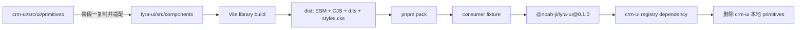

# Lyra UI 独立组件库拆分设计

- 日期：2026-07-10
- 状态：Approved
- 源仓库：`/Users/noahji/workspace/code/linyi/frontend/crm-ui`
- 源基准提交：`a46db7ee`
- 目标仓库：`/Users/noahji/workspace/code/github/lyra-ui`
- 目标基准提交：`914c41a`
- npm 包：`@noah-ji/lyra-ui`
- 首个版本：`0.1.0`
- 许可证：MIT

## 1. 背景与目标

`crm-ui/src/ui/primitives` 已形成一套基于 React 19、Radix UI、Tailwind CSS、
CSS variables 和 Storybook 的基础组件集。目前组件源码、测试、stories、主题 token、
样式工具和浮层层级管理仍内嵌在 CRM 应用中，无法作为独立包复用或独立发布。

本次目标是把该组件集提取到现有 `lyra-ui` Git 仓库，将目标仓库重建为可测试、
可打包、可发布的独立组件库，并最终让 `crm-ui` 通过 npm registry 消费它。

最终状态：

1. `lyra-ui` 是 primitives 的唯一源码来源。
2. npm 公开包名为 `@noah-ji/lyra-ui`。
3. 包提供 ESM、CJS、TypeScript 声明和单一 `styles.css`。
4. `crm-ui` 不再保留 `src/ui/primitives` 副本。
5. 组件 props、行为、视觉、键盘交互、ARIA 和浮层层级保持兼容。

## 2. 已确认决策

| 决策点 | 结论 |
|---|---|
| 拆分范围 | 完整迁移 `src/ui/primitives`，不迁移 composites、patterns 或 CRM 业务代码 |
| 仓库策略 | 目标仓库保留 Git 历史，替换现有 Button/LESS 试验代码和过时配置 |
| npm 包名 | `@noah-ji/lyra-ui` |
| 发布方式 | 公开 scoped package |
| 初始版本 | `0.1.0` |
| 许可证 | MIT |
| 兼容策略 | 保持现有组件 API、行为和视觉兼容，收敛公开导入路径 |
| 样式交付 | 包内编译并发布 `styles.css`，消费者不扫描库源码 |
| 实施方式 | 两阶段交付：先提取并发布，再迁移 `crm-ui` |
| 发布操作 | 首次发布由用户人工登录 npm 并完成 2FA，后续配置 Trusted Publishing |

## 3. 范围与边界

### 3.1 纳入范围

- `src/ui/primitives` 下全部实现、公开类型、stories 和 MDX 说明。
- `tests/ui/primitives` 下现有 56 个测试文件。
- primitives 依赖的主题 token、motion、DataTable CSS、`cn` 和 z-index 管理。
- 独立包构建、类型声明、Storybook、测试、lint、CI 和发布配置。
- 用真实 tarball 验证 exports、类型声明、运行时依赖和 CSS 的 consumer fixture。
- 第二阶段的 `crm-ui` 导入迁移、本地 primitives 删除和 registry 依赖验证。

### 3.2 不纳入范围

- `src/ui/composites`、`src/ui/patterns`、页面、路由、接口、认证和业务文案。
- 借拆库重新设计组件 props、视觉或交互。
- 把 CRM AppShell token 纳入组件库。
- 首次发布前引入多包 monorepo、主题编辑器或额外框架适配层。

## 4. 目标架构



目标目录：

```text
lyra-ui/
├── src/
│   ├── components/
│   │   ├── general/
│   │   ├── data-input/
│   │   ├── data-view/
│   │   ├── navigation/
│   │   └── feedback/
│   ├── internal/
│   │   └── cn.ts
│   ├── overlay/
│   │   └── z-stack.ts
│   ├── styles/
│   └── index.ts
├── tests/
├── fixtures/
│   └── consumer/
├── docs/
├── .storybook/
└── dist/
```

`dist`、Storybook 静态输出和 tarball 不提交 Git。

## 5. 组件与公开 API

迁移五组组件：

- `general`：Button、Divider、Flex、Grid、Icon、ScrollArea、Space、Typography。
- `data-input`：Cascader、Checkbox、DatePicker、Form、Input、Radio、SearchInput、
  SearchInputWithPanel、SearchSuggestionPanel、Select、Switch、TimePicker、Upload。
- `data-view`：Avatar、Badge、Card、Collapse、DataTable、Descriptions、Empty、Image、
  Popover、Statistic、Tag、Timeline、Tooltip。
- `navigation`：Breadcrumb、DropdownMenu、Menu、Pagination、Steps、Tabs。
- `feedback`：Alert、Dialog、Drawer、Message、Modal、Notification、Popconfirm、Progress、
  Result、Skeleton、Spin、Watermark。

公开导入层级：

```ts
import { Button, Drawer } from '@noah-ji/lyra-ui';
import { Select } from '@noah-ji/lyra-ui/data-input';
import { DataTable } from '@noah-ji/lyra-ui/data-view/data-table';
import {
  Z_BASE,
  useOverlayZIndex,
} from '@noah-ji/lyra-ui/overlay';
import '@noah-ji/lyra-ui/styles.css';
```

导出规则：

1. 根入口保持当前 primitives 根 barrel 的导出语义，避免名称冲突。
2. 提供五个分类入口和逐组件入口，支持 tree-shaking。
3. 不导出 `variants.ts`、`context.ts` 等任意内部文件路径。
4. 当前确需跨边界使用的 Form context/type 提升为正式公开 API。
5. `cn` 只服务库内实现，不形成公开兼容承诺。
6. z-index 管理器是正式低层 API，供消费者组合浮层共享层级状态。

### 5.1 浮层状态边界

`crm-ui` 的 `ConfirmDialog` 当前与 primitives 共用同一个单调递增 z-index 管理器。
若拆包后两侧各保留一个计数器，嵌套 Drawer、Dialog、Popover 等场景可能发生遮挡回归。

因此 `@noah-ji/lyra-ui/overlay` 正式导出：

- `Z_BASE`
- `acquireZIndex`
- `useZIndex`
- `useOverlayZIndex`

第二阶段把 `ConfirmDialog` 迁移到该入口，并在引用归零后删除
`crm-ui/src/ui/overlay/z-stack.ts`。

## 6. 依赖与构建

### 6.1 依赖分类

- `peerDependencies`：`react`、`react-dom`。
- `dependencies`：Radix UI 各 primitive、TanStack Table、dayjs、lucide-react、
  class-variance-authority、clsx、tailwind-merge 等组件运行时依赖。
- `devDependencies`：TypeScript、Vite、Tailwind 构建工具、Vitest、Testing Library、
  Storybook、Biome 和类型包。

React 同时放入 devDependencies 供本仓库开发和测试，但发布包只通过 peer contract
要求消费者提供 React，避免出现多份 React 实例。

### 6.2 构建产物

Vite library mode 负责 JavaScript 与 CSS 构建，TypeScript 负责声明文件。发布内容仅包含：

- ESM 入口。
- CJS 入口。
- `.d.ts` 与 declaration map。
- `styles.css`。
- README、LICENSE、package metadata。

`package.json` 必须配置：

- `files: ["dist"]`
- 完整 `exports`
- `sideEffects: ["**/*.css"]`
- `publishConfig.access: "public"`
- 与 `git@github.com:noahjzc/lyra-ui.git` 对应的 repository metadata

## 7. 样式契约

`styles.css` 是应用根入口只导入一次的全局设计系统样式，包含：

- 默认品牌与语义 CSS variables。
- 浅色和 `[data-theme="dark"]` 主题变量。
- motion token、keyframes 和 reduced-motion 规则。
- Tailwind 编译后的基础层与 primitives 使用的 utilities。
- DataTable 等组件专用 CSS。

该文件延续当前 `theme.css` 的全局样式语义。消费者可以在导入后覆盖 CSS variables，
但不需要安装 Tailwind 或扫描 `node_modules` 源码。

`crm-ui/src/ui/tokens/shell.css` 属于 AppShell/patterns，留在 CRM 项目，并在组件库
`styles.css` 之后导入。组件库不导出 CRM shell 尺寸、菜单或工作台布局 token。

## 8. 两阶段实施流程

### 8.1 阶段一：提取、验证与发布

阶段一只修改 `lyra-ui`，不修改或删除 `crm-ui` 源码。

1. 记录源提交 `a46db7ee` 和 primitives 测试基线。
2. 删除目标仓库现有 Button/LESS 试验实现和不再适用的配置。
3. 先迁移测试、stories 和文档，再迁移最小兼容实现。
4. 迁入主题、样式工具和共享浮层管理，清除 CRM 路径别名。
5. 建立公开 exports、类型声明和 CSS 构建。
6. 执行 lint、typecheck、test、build、Storybook build。
7. 执行 `pnpm pack` 并审计 tarball 文件列表。
8. consumer fixture 安装 tarball，验证 ESM、CJS、类型、CSS 和生产构建。
9. 用户人工完成首次 npm 发布。
10. fixture 从 npm registry 安装 `@noah-ji/lyra-ui@0.1.0` 并复验。

阶段一结束时，`crm-ui` 仍使用本地 primitives。两阶段之间原则上冻结 primitives；
若发生变更，阶段二开始前必须与 `a46db7ee` 做差异审计。

### 8.2 阶段二：crm-ui 消费迁移

阶段二只在 registry 中的 `0.1.0` 已可安装后开始。

1. 在 `crm-ui` 添加 `@noah-ji/lyra-ui` registry 依赖。
2. 把根入口、分类入口和深层入口导入迁移到包的公开 exports。
3. 在应用根入口导入包的 `styles.css`，继续导入本地 `shell.css`。
4. 把 `ConfirmDialog` 切换到包的 overlay API。
5. 运行全量测试、lint、build、Storybook 和视觉检查。
6. 确认所有 `@/ui/primitives` 引用归零。
7. 删除本地 primitives 和旧 z-stack。
8. 再次执行全部验证并提交迁移。

若阶段二发现包契约问题，应在 `lyra-ui` 修复并发布 `0.1.1`，不得修改
`node_modules`、复制包源码或在 `crm-ui` 创建兼容分叉。

## 9. 测试与验收

### 9.1 阶段一自动验证

```bash
pnpm lint
pnpm typecheck
pnpm test
pnpm build
pnpm build-storybook
pnpm pack
```

验收条件：

- 迁入的 56 个 primitives 测试文件全部通过。
- consumer fixture 可使用根、分类、逐组件和 overlay 入口。
- fixture 可读取声明文件、导入 CSS 并完成生产构建。
- tarball 不包含测试、缓存、Storybook 静态站、凭据和无关源码。
- 五类组件各选代表 Story 完成浅色与深色截图检查。
- Dialog、Drawer、Popover、Select、Tooltip 和嵌套浮层完成焦点、键盘和层级检查。

### 9.2 阶段二自动验证

```bash
pnpm test
pnpm lint
pnpm build
pnpm build-storybook
```

验收条件：

- `@/ui/primitives` 引用为零。
- 本地 primitives 和旧 z-stack 删除后无残留引用。
- 最终依赖来自 npm registry，不存在 `file:`、tgz 或 Git dependency。
- 代表性 CRM 页面、composites 和 patterns 无视觉或交互回归。

## 10. CI 与发布

普通 CI 对每次 pull request 或主分支提交执行安装、lint、typecheck、test 和 build。
发布工作流只响应受保护的版本 tag，并在发布前重复全部门禁。

由于新 scoped package 尚不存在，首次 `0.1.0` 由用户在本地人工发布：

1. 确认 npm 用户为 `noah-ji` 并启用 2FA。
2. 登录 npm。
3. 运行发布前审计和 `npm publish --access public`。
4. 校验 registry metadata、tarball 和安装结果。

首次发布后，在 npm package settings 为 GitHub 仓库 `noahjzc/lyra-ui` 配置
Trusted Publisher。GitHub Actions 使用 GitHub 托管 runner、`id-token: write`、
Node 24 和 npm `>=11.5.1`，不保存长期写 token。公开仓库发布公开包时由 npm
自动生成 provenance。

最终交付时提供逐步发布教程；代理不代替用户执行首次 npm 身份验证或 2FA。

## 11. 失败处理与回滚

- 若源测试基线失败，先记录和定位，不把既有失败伪装为迁移回归。
- 阶段一任一自动或人工门禁失败时禁止发布。
- npm 已发布版本不可覆盖；缺陷通过 `0.1.1` 修复，必要时 deprecate `0.1.0`。
- 阶段二验证完成前保留本地 primitives，应用可以撤销依赖和 import 迁移恢复原状。
- 不通过 alias 回退、源码复制或双实现长期并存绕过失败。
- 不修改用户未提交的无关变更；开始每个阶段前重新检查两个仓库状态。

## 12. 实施计划边界

本设计覆盖最终目标，但拆为两个独立实施计划：

1. 当前只编写并执行阶段一计划：提取、验证和首次发布准备。
2. 用户完成 `0.1.0` 首次发布并确认 registry 可用后，再编写阶段二计划：
   `crm-ui` 消费迁移和本地源码删除。

阶段二不得在未发布包或仅本地 tgz 的基础上开始。
